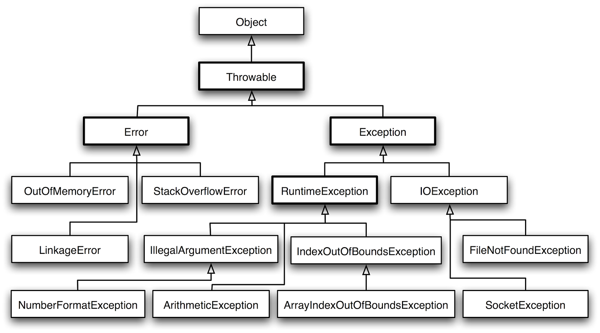

# [JAVA] - BUỔI 9: LUÔN CÓ NGOẠI LỆ, XỬ LÍ NGOẠI LỆ

## Exception

- Exception là một sự kiện có thể xảy ra trong quá trình thực thi của chương trình, và nó có thể làm gián đoạn luồng xử lý thông thường của chương trình đó.
- Khi những exception này xuất hiện trong lúc thực thi trường trình, chúng ta cần có một cơ chế để xử lý các ngoại lệ này, tránh việc các exception này làm gián đoạn, tổn hại hay chết chương trình. Quá trình trên gọi là exception handling (xử lý ngoại lệ)

### Định nghĩa: 
- Trong Java, Exception là một class rất đặc biệt được dùng để đại diện cho các ngoại lệ trong quá trình thực thi chương trình. Khi một class Exception được phát hiện, chúng ta cần phải xử lý ngoại lệ đó trong trương trình.
- Có 3 loại ngoại lệ theo Sun Microsystem đó là: 
  - **Checked Exception:** Checked Exceptions là những exception mà compiler kiểm tra tại thời điểm biên dịch.
    - Một số ví dụ về checked exceptions trong Java bao gồm:
      - **IOException**: Đại diện cho các ngoại lệ liên quan đến việc đọc và ghi dữ liệu vào các nguồn ngoại tuyến như tệp tin, mạng, vv.
      - **SQLException**: Đại diện cho các ngoại lệ liên quan đến cơ sở dữ liệu khi gặp lỗi trong quá trình truy cập, truy vấn hoặc cập nhật dữ liệu.
      - **ClassNotFoundException**: Xảy ra khi một lớp không được tìm thấy trong quá trình tải lớp.
      - **InterruptedException**: Đại diện cho các ngoại lệ xảy ra khi một luồng đang trong trạng thái chờ đợi bị gián đoạn.
      - Ví dụ minh họa về cách xử lý checked exception bằng cách sử dụng khối try-catch hoặc khai báo throws:
      ```Java
        import java.io.FileReader;
        import java.io.IOException;

        public class Main {
            public static void main(String[] args) {
                try {
                    readFile();
                } catch (IOException e) {
                    System.out.println("Lỗi đọc tệp tin: " + e.getMessage());
                }
            }

            public static void readFile() throws IOException {
                FileReader reader = new FileReader("file.txt");
                // Đọc tệp tin...
                reader.close();
            }
        }
        // output: Lỗi đọc tệp tin: file.txt
      ```
      Trong ví dụ trên, phương thức `readFile()` có khai báo throws IOException để biểu thị rằng nó có thể ném ra một ngoại lệ IOException. Trong phương thức main(), chúng ta gọi readFile() trong một khối try-catch và xử lý ngoại lệ IOException bằng cách in ra thông báo lỗi tương ứng.

      -  *Nếu chúng ta không xử lý checked exception bằng cách sử dụng khối try-catch hoặc khai báo throws, trình biên dịch sẽ báo lỗi biên dịch và không cho phép chương trình biên dịch thành công.*
  - **Unchecked Exception:**
    - Trong Java, unchecked exceptions (ngoại lệ không kiểm tra), cũng được gọi là runtime exceptions (ngoại lệ thời gian chạy), là các loại ngoại lệ mà trình biên dịch không yêu cầu phải khai báo hoặc xử lý trong mã nguồn. Ngược lại với checked exceptions, unchecked exceptions không cần phải được khai báo trong phần khai báo throws hoặc phải được bao quanh bởi khối try-catch.
    - Các unchecked exceptions thường phát sinh trong quá trình thực thi chương trình và thường là do lỗi logic hoặc điều kiện không hợp lệ trong mã nguồn. 
    - Một số ví dụ về unchecked exceptions trong Java bao gồm:

      - **NullPointerException**: Xảy ra khi một tham chiếu đối tượng null được sử dụng.
      - **IllegalArgumentException**: Xảy ra khi đối số được truyền vào một phương thức không hợp lệ.
      - **IndexOutOfBoundsException**: Xảy ra khi một chỉ số không hợp lệ được truy cập trong một mảng hoặc một danh sách.
      - **ArithmeticException**: Xảy ra khi một phép tính toán không hợp lệ được thực hiện, ví dụ như chia cho 0.
      - Ví dụ minh họa về unchecked exception:
      ```Java
        public class Main {
            public static void main(String[] args) {
                String str = null;
                try {
                    int length = str.length();
                } catch (NullPointerException e) {
                    System.out.println("Lỗi: Tham chiếu đối tượng null.");
                }
            }
        }
        // output: Lỗi: Tham chiếu đối tượng null.
      ```
      - Trong ví dụ trên, chúng ta gọi phương thức `length()` trên một đối tượng chuỗi str mà có giá trị là null. Điều này dẫn đến ném ra một ngoại lệ NullPointerException. Trong khối try-catch, chúng ta xử lý ngoại lệ bằng cách in ra thông báo lỗi tương ứng.

    - Một đặc điểm quan trọng của unchecked exceptions là chúng không yêu cầu xử lý ngay lập tức. Điều này có thể dẫn đến việc chương trình dừng lại (crash) nếu không có xử lý ngoại lệ phù hợp. Tuy nhiên, Java cung cấp cho chúng ta khả năng xử lý unchecked exceptions bằng cách sử dụng khối try-catch để bắt và xử lý ngoại lệ hoặc để chương trình dừng lại nếu không có xử lý ngoại lệ.
  - **Error:**
    - Trong Java, Error là một loại ngoại lệ đặc biệt được sử dụng để đại diện cho các lỗi nghiêm trọng và không thể khắc phục được trong quá trình thực thi chương trình. Các Error thường xảy ra do các vấn đề liên quan đến môi trường thực thi Java hoặc các tình huống ngoại lệ mà chương trình không thể xử lý hoặc phục hồi.
    - Một số ví dụ về Error trong Java bao gồm:

      - OutOfMemoryError: Xảy ra khi không còn đủ bộ nhớ để cấp phát cho đối tượng mới hoặc để thực hiện các phép toán khác.
      - StackOverflowError: Xảy ra khi stack (ngăn xếp) của một luồng bị đầy do quá nhiều cuộc gọi đệ quy không kết thúc.
      - NoClassDefFoundError: Xảy ra khi một lớp được tham chiếu không được tìm thấy trong quá trình chạy.
      - LinkageError: Xảy ra khi có một lỗi trong quá trình liên kết (linking) các thư viện hoặc lớp.
      ```java
        public class Main {
            public static void main(String[] args) {
                int[] array = new int[Integer.MAX_VALUE];
            }
        }
        // lỗi OutOfMemoryError
      ```
### Try-catch
- Trong Java, bạn có thể bắt (catch) các ngoại lệ (exceptions) bằng cách sử dụng khối mã "try-catch". 
- **try:** Khối try chứa đoạn mã có thể gặp lỗi hoặc ném ra ngoại lệ khi thực thi. Nếu có bất kỳ ngoại lệ nào xảy ra trong khối try, chương trình sẽ chuyển quyền kiểm soát đến khối catch tương ứng.
Mỗi khối try phải theo sau ít nhất một khối catch hoặc một khối finally.
- **catch:** Khối catch chứa đoạn mã sẽ được thực thi nếu có ngoại lệ xảy ra trong khối try tương ứng. Khối catch chủ yếu được sử dụng để xử lý ngoại lệ hoặc ghi log về lỗi.
Có thể có nhiều khối catch sau một khối try, mỗi khối catch xử lý một loại ngoại lệ cụ thể.
- Cú pháp chung của khối "try-catch" như sau: 
    ```Java
        try {
        // Mã có thể gây ra ngoại lệ
        } catch (ExceptionType1 exception1) {
            // Xử lý ngoại lệ ExceptionType1
        } catch (ExceptionType2 exception2) {
            // Xử lý ngoại lệ ExceptionType2
        }
    ```
- ví dụ :
    ```java
    public class Main {
        public static void main(String[] args) {
            try {
                int result = divide(10, 0);
                System.out.println("Kết quả: " + result);
            } catch (ArithmeticException e) {
                System.out.println("Lỗi chia cho 0: " + e.getMessage());
            } 
        }

        public static int divide(int a, int b) {
            return a / b;
        }
    }
    //Lỗi chia cho 0: / by zero

    ```
    - Trong ví dụ trên, phương thức divide chia một số cho 0, gây ra một ngoại lệ ArithmeticException. Trong khối main, chúng ta sử dụng khối try-catch để bắt ngoại lệ này. Nếu ngoại lệ xảy ra, chương trình sẽ nhảy tới khối catch tương ứng và in ra thông báo lỗi. 
### Finally
- Khối finally trong Java được sử dụng để đặt mã thực thi sau khi một khối try-catch kết thúc, bất kể có ngoại lệ xảy ra hay không. Điều này đảm bảo rằng các hành động cuối cùng được thực hiện, bất kể ngoại lệ có được xử lý hay không. 
- Cú pháp của khối finally như sau:
    ```java
        try {
    // Mã có thể gây ra ngoại lệ
    } catch (ExceptionType exception) {
        // Xử lý ngoại lệ
    } finally {
        // Mã thực thi sau khi try-catch kết thúc
    }
    ```
- ví dụ :
    ```java
    public class Main {
        public static void main(String[] args) {
            try {
                int result = divide(10, 2);
                System.out.println("Kết quả: " + result);
            } catch (ArithmeticException e) {
                System.out.println("Lỗi chia cho 0: " + e.getMessage());
            } finally {
                System.out.println("Khối finally được thực thi.");
            }
        }

        public static int divide(int a, int b) {
            try {
                return a / b;
            } catch (ArithmeticException e) {
                System.out.println("Lỗi chia cho 0 trong phương thức divide: " + e.getMessage());
                throw e;
            } finally {
                System.out.println("Khối finally trong phương thức divide được thực thi.");
            }
        }
    }
    /* output
    Kết quả: 5
    Khối finally trong phương thức divide được thực thi.
    Khối finally được thực thi.
    */
    ```
    - Trong ví dụ trên, chúng ta có một phương thức divide mà chia một số cho 0. Trong khối divide, chúng ta sử dụng một khối try-catch để bắt ngoại lệ ArithmeticException khi chia cho 0. Trong khối catch, chúng ta in ra thông báo lỗi và sau đó ném lại ngoại lệ. Cuối cùng, chúng ta có một khối finally để in ra một thông điệp sau khi khối try-catch hoặc khối catch kết thúc.
### Cây phân cấp Exception
- Cả hai lớp Error và Exception đều kế thừa từ một lớp cha, có tên là Throwable.
 
#### Throw và Throws
- **Throw:** từ khoá này được sử dụng để tạo ra một ngoại lệ cụ thể và chuyển quyền kiểm soát từ phương thức hiện tại đến phương thức gọi (calling method) hoặc một khối catch tương ứng nếu có.
  - Ví dụ:
      ```java
      public void validateAge(int age) {
          if (age < 0) {
              throw new IllegalArgumentException("Age cannot be negative");
          }
      }
      ```
      Trong ví dụ trên, nếu đối số age có giá trị âm, chúng ta sẽ ném một ngoại lệ IllegalArgumentException bằng cách sử dụng từ khóa throw. Điều này sẽ kích hoạt các khối mã xử lý ngoại lệ phù hợp.
- **Throws:** từ khoá này được dùng để khai báo rằng function sẽ có thể ném ra ngoại lệ tương ứng. Mỗi một function có thể khai báo nhiều hơn 1 kiểu exception.
    Khi function khai báo từ khoá throws, điều đó có nghĩa là trách nhiệm xử lý exception này thuộc calling method (phương thức gọi) hoặc một calling method xa hơn.
    - ví dụ:
    ```java
        public void readFile() throws IOException {
        // Mã để đọc tệp tin
        }
    ```
    - Trong ví dụ trên, phương thức readFile được khai báo throws IOException, cho biết rằng phương thức này có thể ném ra một ngoại lệ IOException. Khi gọi phương thức readFile, mã gọi phải xử lý hoặc chuyển tiếp ngoại lệ IOException.

> Tóm lại, từ khóa throw được sử dụng để ném một ngoại lệ cụ thể từ một phương thức hoặc khối mã, trong khi throws được sử dụng để khai báo các ngoại lệ mà một phương thức có thể ném ra, thông báo cho người gọi phải xử lý hoặc chuyển tiếp các ngoại lệ đó.
