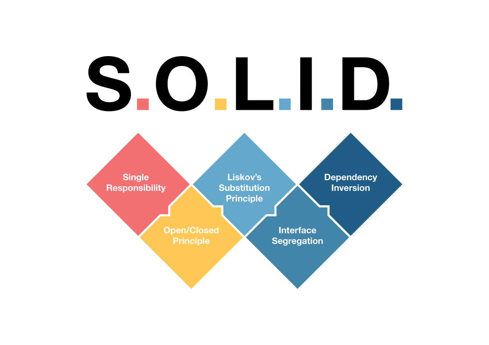
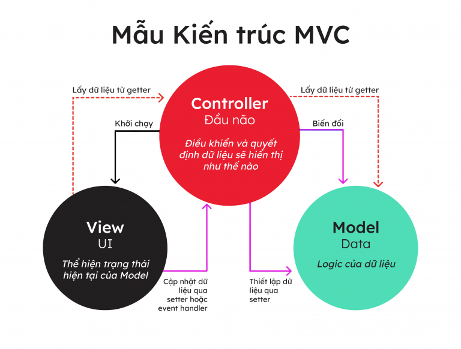
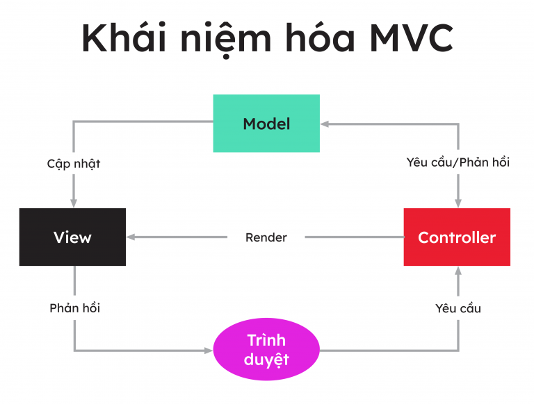

# CÁC NGUYÊN TẮC THIẾT KẾ, MÔ HÌNH THIẾT KẾ
## 1. SOLID 
- SOLID là một tập hợp các nguyên tắc thiết kế phần mềm cơ bản, được đưa ra để giúp các nhà phát triển tạo ra các hệ thống phần mềm dễ bảo trì, dễ mở rộng và dễ tái sử dụng.  SOLID là viết tắt của năm nguyên tắc thiết kế phần mềm cơ bản đó là:
    - **S**ingle responsibility priciple (SRP)
    - **O**pen/Closed principle (OCP)
    - **L**iskov substitution principe (LSP)
    - **I**nterface segregation principle (ISP)
    - **D**ependency inversion principle (DIP)
    
- Việc sử dụng SOLID giúp cho mã nguồn của chúng ta dễ dàng bảo trì và mở rộng hơn, đồng thời cũng tăng khả năng sử dụng lại mã nguồn cho các dự án sau này. Cụ thể, lợi ích của SOLID bao gồm:
  - Giảm thiểu sự phức tạp của mã nguồn: SOLID giúp chia nhỏ các thành phần trong phần mềm thành các đơn vị độc lập và giúp tách biệt các trách nhiệm giữa các lớp, giúp cho mã nguồn trở nên dễ đọc và hiểu hơn.
  - Dễ dàng bảo trì và mở rộng: SOLID giúp cho mã nguồn dễ dàng bảo trì và mở rộng hơn, đặc biệt là trong các dự án lớn. Khi một thành phần trong phần mềm cần được thay đổi, chúng ta chỉ cần thay đổi thành phần đó mà không ảnh hưởng đến các thành phần khác.
  - Tăng tính linh hoạt và khả năng tái sử dụng mã nguồn: SOLID giúp cho mã nguồn có tính linh hoạt cao hơn và khả năng tái sử dụng mã nguồn cao hơn. Các thành phần của phần mềm được thiết kế để có thể được sử dụng lại cho các dự án khác, giúp tiết kiệm thời gian và chi phí cho việc phát triển phần mềm.
### 1.1 Single responsibility Principle
- **Nguyên lý: Mỗi lớp chỉ nên chịu trách nhiệm duy nhất một nhiệm vụ**
- Theo nguyên lý SRP, mỗi class hay module trong phần mềm chỉ nên có một trách nhiệm (responsibility) duy nhất và các trách nhiệm này nên được phân chia rõ ràng. Nếu một class hoặc module thực hiện quá nhiều nhiệm vụ thì sẽ dẫn đến sự phức tạp của mã nguồn, khó bảo trì và mở rộng. 
- Nguyên lý SRP cho phép chúng ta chia nhỏ và phân tách các thành phần trong phần mềm thành các đơn vị độc lập, mỗi đơn vị chỉ chịu trách nhiệm cho một nhiệm vụ cụ thể. Điều này giúp cho mã nguồn trở nên dễ đọc và hiểu hơn, dễ bảo trì và mở rộng hơn, đồng thời giảm thiểu sự phức tạp của mã nguồn.
- Ví dụ: Để minh họa nguyên tắc SRP là chia nhỏ một chương trình quản lý thông tin người dùng thành các lớp riêng biệt, chẳng hạn User và UserManager. Lớp User chịu trách nhiệm chỉ lưu trữ thông tin cá nhân của người dùng như tên, địa chỉ, email, số điện thoại, vv. Trong khi đó, lớp UserManager chịu trách nhiệm quản lý các thao tác liên quan đến người dùng như tạo người dùng mới, xóa người dùng, cập nhật thông tin người dùng, vv. Bằng cách tách biệt các trách nhiệm này vào các lớp riêng biệt, ta đảm bảo rằng mỗi lớp chỉ có một nhiệm vụ duy nhất và sẽ không bị ảnh hưởng khi có sự thay đổi trong các nhiệm vụ khác.
```Java
public class User {
    private String name;
    private String address;
    private String email;
    private String phoneNumber;

    // Constructor, getters, and setters
}

public class UserManager {
    public void createUser(User user) {
        // Logic to create a new user
    }

    public void deleteUser(User user) {
        // Logic to delete a user
    }

    public void updateUser(User user) {
        // Logic to update user information
    }
}

public class Main {
    public static void main(String[] args) {
        User user = new User();
        user.setName("Monkey");
        user.setAddress("KTX B2");
        user.setEmail("monkeyhaha@gmail.com");
        user.setPhoneNumber("0910 10009");

        UserManager userManager = new UserManager();
        userManager.createUser(user);
    }
}
```
### 1.2 Open/Closed principle 
- **Nguyên lý: Không được sửa đổi thành phần có sẵn, nhưng có thể mở rộng bằng kế thừa**
- Trong đó:
  - Mở rộng có nghĩa là thêm chức năng mới vào class hiện có.
  - Sửa đổi có nghĩa là thay đổi code của một class hiện có.
- Vì vậy, nội dung nguyên tắc Mở/đóng có nghĩa là: Chúng ta có thể thêm chức năng mới mà không cần đụng vào code hiện có của class.
- Nguyên nhân là do bất cứ khi nào ta sửa đổi code hiện có, luôn sẽ có nguy cơ tạo ra các lỗi tiềm ẩn. Vì vậy, nếu có thể, chúng ta nên tránh chạm vào code đã được kiểm tra và đang chạy ổn.
- Ví dụ: 
```Java
// Giao diện Shape đại diện cho một hình học
public interface Shape {
    double tinhDienTich();
}

// Lớp Rectangle triển khai giao diện Shape
public class Rectangle implements Shape {
    private double chieuDai;
    private double chieuRong;

    public Rectangle(double chieuDai, double chieuRong) {
        this.chieuDai = chieuDai;
        this.chieuRong = chieuRong;
    }

    public double getChieuDai() {
        return chieuDai;
    }

    public void setChieuDai(double chieuDai) {
        this.chieuDai = chieuDai;
    }

    public double getChieuRong() {
        return chieuRong;
    }

    public void setChieuRong(double chieuRong) {
        this.chieuRong = chieuRong;
    }

    public double tinhDienTich() {
        return chieuDai * chieuRong;
    }
}

// Lớp Circle triển khai giao diện Shape
public class Circle implements Shape {
    private double banKinh;

    public Circle(double banKinh) {
        this.banKinh = banKinh;
    }

    public double getBanKinh() {
        return banKinh;
    }

    public void setBanKinh(double banKinh) {
        this.banKinh = banKinh;
    }

    public double tinhDienTich() {
        return Math.PI * banKinh * banKinh;
    }
}

// Lớp AreaCalculator tính tổng diện tích của các hình
public class AreaCalculator {
    public double tinhTongDienTich(Shape[] shapes) {
        double tongDienTich = 0;

        for (Shape shape : shapes) {
            tongDienTich += shape.tinhDienTich();
        }

        return tongDienTich;
    }
}

public class Main {
    public static void main(String[] args) {
        Shape[] shapes = new Shape[2];
        shapes[0] = new Rectangle(5, 10);
        shapes[1] = new Circle(3);

        AreaCalculator calculator = new AreaCalculator();
        double tongDienTich = calculator.tinhTổngDienTich(shapes);
        System.out.println("Tổng diện tích: " + tongDienTich);
    }
}
```
### 1.3 Liskov Substitution principle
- **Nguyên lý: Các đối tượng (instance) kiểu class con có thể thay thế các đối tượng kiểu class cha mà không gây ra lỗi.**
- Theo nguyên lý LS, một lớp con nên thừa hưởng các thuộc tính và phương thức từ lớp cha, đồng thời cũng cần phải tuân thủ tất cả các quy tắc và hành vi của lớp cha. Nghĩa là, khi một đối tượng được khởi tạo từ lớp con, nó cần có thể thực hiện tất cả các chức năng mà đối tượng từ lớp cha có thể thực hiện một cách như nhau.
- Việc áp dụng nguyên lý LS giúp cho các lớp trong chương trình trở nên linh hoạt và dễ dàng mở rộng. Nó giúp đảm bảo tính đúng đắn của chương trình khi có sự thay đổi ở cấp độ lớp con, đồng thời giúp giảm thiểu các lỗi liên quan đến sự không tương thích giữa các lớp.
- Ví dụ:
```Java
class Rectangle {
    protected int width;
    protected int height;

    public void setWidth(int width) {
        this.width = width;
    }

    public void setHeight(int height) {
        this.height = height;
    }

    public int getArea() {
        return width * height;
    }
}

class Square extends Rectangle {
    @Override
    public void setWidth(int width) {
        this.width = width;
        this.height = width;
    }

    @Override
    public void setHeight(int height) {
        this.width = height;
        this.height = height;
    }
}

public class Main {
    public static void main(String[] args) {
        Rectangle rectangle = new Rectangle();
        rectangle.setWidth(5);
        rectangle.setHeight(10);
        System.out.println("Rectangle area: " + rectangle.getArea());

        Square square = new Square();
        square.setWidth(5);
        square.setHeight(10); // Vi phạm nguyên tắc Liskov Substitution
        System.out.println("Square area: " + square.getArea());
    }
}
```
  - Trong ví dụ này, chúng ta có hai lớp Rectangle và Square. Lớp Rectangle có các thuộc tính width và height và phương thức để thiết lập và tính diện tích (getArea). Lớp Square kế thừa từ lớp Rectangle và ghi đè các phương thức setWidth và setHeight để đảm bảo rằng width và height luôn bằng nhau, tạo ra một hình vuông.
  - Tuy nhiên, trong phương thức main, khi chúng ta tạo một đối tượng Square và thiết lập width và height với các giá trị khác nhau, như setWidth(5) và setHeight(10), việc này vi phạm nguyên tắc Liskov Substitution. Bởi vì khi một đối tượng Square được sử dụng thay thế cho đối tượng Rectangle, nó phải tuân thủ các hợp đồng của lớp cha. Trong trường hợp này, chúng ta đang gán giá trị không nhất quán cho width và height, dẫn đến kết quả không chính xác khi tính diện tích của hình vuông.
  - Vi phạm nguyên tắc Liskov Substitution có thể dẫn đến sự không đáng tin cậy và lỗi trong chương trình, vì các lớp con không thể thay thế lớp cha mà không làm thay đổi tính đúng đắn của chương trình.
## 2. KISS (Keep It Simple, Stupid)
- Nguyên tắc KISS (Keep It Simple, Stupid) là một nguyên tắc thiết kế phần mềm đơn giản được đề xuất bởi Kelly Johnson. Nguyên tắc này khuyến nghị rằng khi thiết kế một hệ thống, bạn nên giữ cho nó đơn giản nhất có thể.
- Nguyên tắc KISS có ý nghĩa là thiết kế và triển khai hệ thống phải được giữ đơn giản và dễ hiểu. Điều này giúp tăng tính khả thi, bảo trì dễ dàng và giảm khả năng phát sinh lỗi. Thay vì tạo ra các giải pháp phức tạp và rườm rà, nguyên tắc KISS khuyến nghị tìm kiếm các giải pháp đơn giản, trực quan và dễ sử dụng.
- Ví dụ: Để chứng minh một số có là số chẵn hay không ta có thể dùng 2 cách như sau:
  - Cách 1: Sử dụng phép chia lấy dư.
      ```java
      public static boolean isEven(int number) {
          return number % 2 == 0;
      }
      ```
  - Cách 2: Sử dụng kiểm tra bit cuối cùng.
      ```java
      public static boolean isEven(int number) {
          return (number & 1) == 0;
      }
      ```
- Cả hai phương pháp đều có thể được sử dụng để chứng minh một số là số chẵn. Tuy nhiên, phương pháp sử dụng phép chia lấy dư có thể dễ hiểu hơn và đơn giản hơn trong việc kiểm tra tính chẵn lẻ của một số.
## 3. DRY (Don’t Repeat Yourself)
- Nguyên tắc này có nghĩa là đừng có viết lặp bất kỳ lại một đoạn mã nào mà hãy đóng gói nó thành phương thức riêng. Đến khi cần thì chỉ cần gọi tên nó ra.
- Nguyên tắc này nó giống như tính chất kế thừa trong lập trình hướng đối tượng OOP mà chúng ta đã quá quen thuộc rồi.
- Ví dụ:
    ```java
    public class Calculator {
        public static int add(int a, int b) {
            return a + b;
        }

        public static int subtract(int a, int b) {
            return a - b;
        }
        public static int mul(int a, int b){
            return a * b;
        }
    }
    ```
- Việc tuân thủ nguyên tắc DRY giúp giảm sự trùng lặp mã code, tăng tính bảo trì và giảm khả năng xảy ra lỗi khi thay đổi mã code trong tương lai.
## 4. YAGNI (You Ain't Gonna Need It)
- Nguyên tắc YAGNI (You Ain't Gonna Need It) khuyến khích chúng ta không nên viết mã code cho các tính năng không cần thiết trong thời điểm hiện tại. Thay vào đó, chúng ta nên tập trung vào viết mã code cho các tính năng thực sự cần thiết và được yêu cầu.
- Ví dụ:
    ```Java
    public class Customer {
        private String name;
        private String email;

        public Customer(String name, String email) {
            this.name = name;
            this.email = email;
        }

        public String getName() {
            return name;
        }

        // Không cần thiết
        public String getEmail() {
            return email;
        }

        // Không cần thiết
        public void setEmail(String email) {
            this.email = email;
        }

        // Không cần thiết
        public void sendEmail(String message) {
            // Gửi email cho khách hàng
        }
    }
    ```
    - Trong ví dụ trên, lớp Customer đại diện cho một khách hàng với các thuộc tính như tên và email. Tuy nhiên, trong thiết kế ban đầu, không có yêu cầu cần truy cập vào email của khách hàng hoặc gửi email cho khách hàng. Do đó, việc cung cấp các phương thức getEmail, setEmail và sendEmail không cần thiết và không tuân thủ nguyên tắc YAGNI.

- Tuân thủ nguyên tắc YAGNI giúp chúng ta tránh việc viết mã code không cần thiết, giảm sự phức tạp và tăng tính đơn giản của hệ thống. Điều này cũng giúp chúng ta tập trung vào viết mã code cho các tính năng thực sự cần thiết và mang lại giá trị cho người dùng.
## 5. Mô hình MVC
- MVC là viết tắt của Model-View-Controller. Cấu trúc Model-View-Controller (MVC) là một mẫu kiến trúc/mẫu thiết kế (design pattern) tách ứng dụng thành ba thành phần logic chính: Model, View và Controller. Mỗi thành phần kiến trúc được xây dựng để xử lý các khía cạnh phát triển cụ thể của một ứng dụng.
- Mục tiêu chính của mẫu thiết kế này là giải quyết vấn đề người dùng kiểm soát một tập dữ liệu lớn và phức tạp bằng cách chia một ứng dụng lớn thành các phần cụ thể, tất cả đều có mục đích riêng.
### 5.1 Các thành phần trong mô hình MVC

- **Model**
    - Model là các thành phần của ứng dụng tương ứng với tất cả logic liên quan đến miền dữ liệu (data domain), hoặc nói ngắn gọn đây là phần back-end chứa tất cả logic dữ liệu của ứng dụng. Dữ liệu ở đây có thể là dữ liệu đang được truyền giữa các thành phần View và Controller hoặc bất kỳ dữ liệu nào khác liên quan đến logic của doanh nghiệp.

    - Nếu trạng thái của dữ liệu này thay đổi thì Model thường sẽ thông báo cho View (để màn hình có thể thay đổi khi cần) và đôi khi là Controller (nếu cần logic khác để cập nhật View).
    > Ví dụ: Giả sử bạn đang phát triển một ứng dụng mua sắm. Ở đây, Model sẽ chỉ định giỏ hàng sẽ bao gồm những dữ liệu nào — như mặt hàng, giá cả, v.v. — và những dữ liệu nào đã có sẵn trong giỏ hàng.
- **View**
    - View là các thành phần hiển thị giao diện người dùng (UI) của ứng dụng. Thông thường, giao diện người dùng này được tạo từ dữ liệu Model. 
    > Ví dụ: Trong ứng dụng mua sắm, View sẽ xác định cách hiển thị giỏ hàng cho người dùng và nhận dữ liệu từ Model để hiển thị. View sẽ bao gồm tất cả các thành phần UI như hiển thị nút bấm, danh sách thả xuống, v.v. mà người dùng cuối cùng tương tác.
- **Controller**
    - Controller là các thành phần xử lý tương tác của người dùng để làm việc với Model (cập nhật logic dữ liệu) hoặc/ và với View (cập nhật hiển thị giao diện người dùng).

    - Trong ứng dụng MVC, Controller xử lý các giá trị chuỗi truy vấn và chuyển các giá trị này cho Model, từ đó Model sẽ truy vấn cơ sở dữ liệu bằng cách sử dụng các giá trị đó. View hiển thị thông tin do Controller xử lý và phản hồi đầu vào từ tương tác của người dùng.
    > Ví dụ: Trong ứng dụng mua sắm, ở giỏ hàng của người dùng, bạn có thể thêm các button cho phép người dùng thêm hoặc xóa các mặt hàng.
    > Những hành động này của người dùng yêu cầu Model phải được cập nhật, do đó, đầu vào sẽ được gửi đến Controller, sau đó Controller sẽ thao tác với Model cho phù hợp, sau đó Controller sẽ gửi dữ liệu cập nhật đến View.
### 5.2 Khái niệm hóa mô hình MVC

- MVC giúp tạo các ứng dụng tách biệt cho các khía cạnh khác nhau của ứng dụng (logic đầu vào, logic nghiệp vụ và logic giao diện người dùng), đồng thời cung cấp sự kết nối giữa các thành phần này.

- Mô hình MVC chỉ định vị trí của từng loại logic trong ứng dụng:

    - Logic nghiệp vụ chính là Model. 
    - Logic giao diện người dùng thuộc về View. 
    - Logic đầu vào thuộc về Controller.

- Ưu điểm của MVC: 
    - Bảo trì code dễ dàng, dễ dàng mở rộng và phát triển.
    - Hỗ trợ dễ dàng hơn cho khách hàng mới.
    - Việc phát triển các thành phần khác nhau có thể được thực hiện song song.
    - Nó giúp bạn tránh sự phức tạp bằng cách chia ứng dụng thành ba đơn vị Model, View và Controller.
    - Cung cấp hỗ trợ tốt nhất cho phát triển theo hướng thử nghiệm.
    - Nó hoạt động tốt cho các ứng dụng Web được hỗ trợ bởi các nhóm lớn các nhà thiết kế và phát triển web.
    - Cung cấp khả năng phân tách rõ ràng các mối quan tâm.
    - Thân thiện với Công cụ Tìm kiếm (SEO).
    - Tất cả các đối tượng được phân loại và đối tượng độc lập với nhau để bạn có thể kiểm tra chúng một cách riêng biệt.
- Nhược điểm khi sử dụng MVC
    - Khó đọc, thay đổi, kiểm tra và sử dụng lại mô hình này.
    - Không có hỗ trợ xác thực chính thức.
    - Tăng độ phức tạp và tính kém hiệu quả của dữ liệu.
    - Khó khăn khi sử dụng MVC với giao diện người dùng hiện đại.
    - Cần có nhiều người lập trình để tiến hành lập trình song song.
    - Cần có kiến ​​thức về nhiều công nghệ.
    - Bảo trì nhiều code trong Controller.