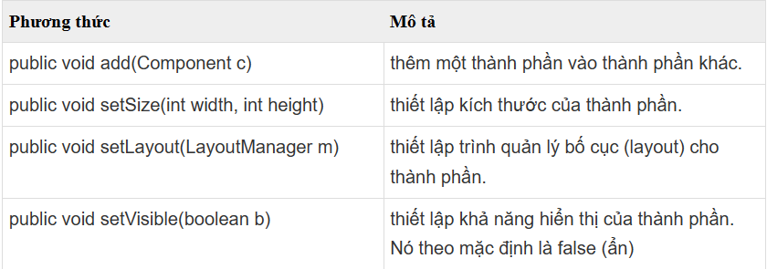

# THƯ VIỆN ĐỒ HOẠ SWING

## 1. Thư viện đồ họa Swing cơ bản
Java Swing là một phần của Java Foundation Classes (JFC) được sử dụng để tạo các ứng dụng window-based. Nó được xây dựng trên API AWT (Abstract Windowing Toolkit) và được viết hoàn toàn bằng Java.

Không giống như AWT, Java Swing cung cấp các thành phần không phụ thuộc vào nền tảng và nhẹ hơn.

Gói javax.swing cung cấp các lớp cho java swing API như JButton, JTextField, JTextArea, JRadioButton, JCheckbox, JMenu, JColorChooser, v.v.
### Phân cấp các lớp Java Swing

### Các phương thức thường dùng của lớp Component

## 2. Một số thành phần cơ bản trong thư viện Java Swing
### JFrame
- JFrame là một lớp trong thư viện Java Swing, đại diện cho một cửa sổ hoặc khung giao diện người dùng đồ họa (GUI) cấp cao trong ứng dụng. Nó cung cấp một container cho các thành phần Swing khác nhau, chẳng hạn như nút, nhãn, ô văn bản và nhiều hơn nữa.
    ```java
    import javax.swing.ImageIcon;
    import javax.swing.JFrame;
    import java.awt.Color;

    public class Main{
        public static void main(String [] args){
            JFrame f = new JFrame();// create a frame
            f.setTitle("Học Java điiiii");//sets title of frame
            f.setDefaultCloseOperation(JFrame.EXIT_ON_CLOSE);// exit out of application
            f.setResizable(false);//
            f.setSize(840,630);// set kich thuoc
            f.setVisible(true);// make frame visible
            ImageIcon image = new ImageIcon("logoPro.png");// tạo 1 hình logo
            f.setIconImage(image.getImage());// thay đổi icon của frame
            f.getContentPane().setBackground(new Color(30,200,255));//(0,0,0)
        }
    }
    ```
    Kết quả:
    
    **Xử lý khi JFrame bị đóng**
    Khi một JFrame được khởi tạo, cho đến khi người dùng tắt JFrame này thì chúng ta có thể định nghĩa các hành động tương ứng mà chúng ta muốn trong giai đoạn này. Java Swing cung cấp 4 hằng số tương ứng với 4 loại hành động sau khi một JFrame bị đóng. Các hằng số này được định nghĩa trong trong avax.swing.WindowsConstants:

      - **DO_NOTHING_ON_CLOSE**: Không làm thêm bất cứ điều gì khi JFrame bị đóng
      - **HIDE_ON_CLOSE**: JFrame sẽ bị ẩn đi khi người dùng đóng nó lại. Chương trình vẫn sẽ hoạt động bình thường trong khi JFrame này bị ẩn. Đây là một hành động mặc định của JFrame.
      - **DISPOSE_ON_CLOSE**: Sau khi bị đóng lại, nó đồng thời sẽ bị dọn dẹp rác, các tài nguyên được JFrame này sử dụng sẽ bị thu hồi nhường chỗ cho những nơi khác sử dụng.
      - **EXIT_ON_CLOSE**: Sau khi JFrame bị đóng, chương trình cũng sẽ tắt theo. Chúng ta có thể đặt hành vi đóng mặc định của JFrame bằng cách chuyển một trong bốn hằng số vào phương thức setDefaultCloseOperation () của nó
### JButton
- JButton là một thành phần trong thư viện Java Swing, đại diện cho một nút hoặc một nút nhấn trong giao diện người dùng đồ họa (GUI). Khi người dùng nhấn vào JButton, bạn có thể xử lý sự kiện nhấn nút bằng cách thêm một ActionListener để thực hiện các hành động tương ứng.
```java
    import javax.swing.*;
    import java.awt.Color;

    public class Main{
        public static void main(String [] args){
            JButton button = new JButton("Ấn vô đây", new ImageIcon());
            button.setBounds(150,180,100,100);
            JFrame f = new JFrame();// create a frame
            f.add(button);
            f.setLayout(null);
            f.setTitle("Học Java điiiii");//sets title of frame
            f.setDefaultCloseOperation(JFrame.EXIT_ON_CLOSE);// exit out of application
            f.setResizable(false);//
            f.setSize(410,430);// set kich thuoc
            f.setVisible(true);// make frame visible
            ImageIcon image = new ImageIcon("logoPro.png");// tạo 1 hình logo
            f.setIconImage(image.getImage());// thay đổi icon của frame
            f.getContentPane().setBackground(new Color(30,200,255));//(0,0,0)
        }
    }

```
   
### JLabel
- JLabel là một thành phần trong thư viện Java Swing, được sử dụng để hiển thị văn bản hoặc hình ảnh không tương tác trên giao diện người dùng đồ họa (GUI). Bạn có thể sử dụng JLabel để hiển thị thông tin, tiêu đề, hoặc bất kỳ văn bản nào khác trên giao diện của ứng dụng.
```java
    import javax.swing.*;
    import java.awt.Color;

    public class Main{
        public static void main(String [] args){
            JLabel label = new JLabel();
            label.setText("Chao Xìn Pro");
            JFrame f = new JFrame();// create a frame
            f.add(label);
            f.setTitle("Học Java điiiii");//sets title of frame
            f.setDefaultCloseOperation(JFrame.EXIT_ON_CLOSE);// exit out of application
            f.setResizable(false);//
            f.setSize(800,800);// set kich thuoc
            f.setVisible(true);// make frame visible
            ImageIcon image = new ImageIcon("src\\logoPro.png");// tạo 1 hình logo
            f.setIconImage(image.getImage());// thay đổi icon của frame
            f.getContentPane().setBackground(new Color(255,255,255));//(0,0,0)
            label.setIcon(image);
            label.setHorizontalTextPosition(JLabel.CENTER);
            label.setVerticalTextPosition(JLabel.TOP);
            label.setForeground(new Color(0x12345));
        }
    }

```

### JTextField
- JTextField là một thành phần trong thư viện Java Swing, được sử dụng để hiển thị và nhập liệu từ người dùng trong giao diện người dùng đồ họa (GUI). Bạn có thể sử dụng JTextField để cho phép người dùng nhập văn bản hoặc lấy giá trị từ một trường văn bản trong ứng dụng của bạn.
```java
    import javax.swing.JFrame;
    import javax.swing.JTextField;

    public class Main {
        public static void main(String[] args) {
            JFrame frame = new JFrame();
            frame.setTitle("Write Somethinggg");
            frame.setSize(400, 300);
            frame.setDefaultCloseOperation(JFrame.EXIT_ON_CLOSE);

            JTextField textField = new JTextField();
            textField.setBounds(50, 50, 200, 30);

            frame.add(textField);
            frame.setLayout(null);
            frame.setVisible(true);
        }
    }
```
### JTable
- JTable là một trong những thành phần quan trọng của Java Swing package được sử dụng để hiển thị và chỉnh sửa dữ liệu theo dạng Table (Dữ liệu được trình bày theo dạng hàng và cột). Nó tương tự như một bảng tính trong excel file.
- **JTable cung cấp một số constructor cho phép khởi tạo một JTable instance như sau:**
    - JTable() – Khởi tạo một JTable rỗng.
    - JTable(int rows, int cols) – Khởi tạo một JTable với số dòng và cột được chỉ định.
    - JTable(Object[][] data, Object []Column) – Khởi tạo một Jtable với các tên cột được chỉ định trong Object[] Column và dữ liệu trong Object[][] data.
- **Một số hàm thường xuyên sử dụng trong JTable:**

    - addColumn(TableColumn column) – Thêm một cột vào cuối bảng.
    - editCellAt(int row, int col) – Chỉnh sửa ô giao nhau của cột số col và hàng số row, nếu các chỉ số đã cho hợp lệ và ô tương ứng có thể chỉnh sửa được.
    - setValueAt(Object value, int row, int col) – Cập nhật giá trị tạo ô có số cột là col và hàng row thành giá trị value mới. 
    - clearSelection() – Bỏ chọn tất cả các cột và hàng trước đó đã được chọn.
```java
    import javax.swing.JFrame;
    import javax.swing.JScrollPane;
    import javax.swing.JTable;

    public class Main {
        public static void main(String[] args) {
            JFrame frame = new JFrame();
            frame.setTitle("Dữ Liệu Về PTIT");
            frame.setSize(400, 300);
            frame.setDefaultCloseOperation(JFrame.EXIT_ON_CLOSE);

            // Dữ liệu mẫu
            Object[][] data = {
                    {"D21", 21, "CNTT"},
                    {"D22", 20, "KHMT"},
                    {"D23", 19, "QTKD"},
            };

            // Tiêu đề cột
            String[] columnNames = {"Khóa", "Tuổi", "Ngành"};

            // Tạo JTable với dữ liệu và tiêu đề cột
            JTable table = new JTable(data, columnNames);

            // Đặt JTable vào JScrollPane để có thanh cuộn nếu cần
            JScrollPane scrollPane = new JScrollPane(table);

            frame.add(scrollPane);
            frame.setVisible(true);
        }
    }
```

### JList
- JList là một thành phần trong thư viện Java Swing, được sử dụng để hiển thị danh sách các mục trong giao diện người dùng đồ họa (GUI). Bạn có thể sử dụng JList để hiển thị danh sách văn bản hoặc các phần tử tùy chỉnh trong ứng dụng của bạn.
- **Để tạo một đối tượng JList trong Swing chúng ta có thể sử dụng một trong số constructor sau:**
    JList() – Tạo JList rỗng.
    JList(E[] items) – Tạo một JList với các phần tử items được chỉ định trong mảng.
    JList(ListModel model) – Tạo một JList với Model được chỉ định sẵn.
    JList(Vector items) – Tạo một JList với các phần tử items được chỉ định trong Vector.
**Một số hàm thường xuyên sử dụng trong JList:**

    getSelectedIndex() – Trả về vị trí của phần tử đang được chọn.
    getSelectedValue() – Trả về giá trị của phần tử đang được chọn.
    setSelectedIndex(int i) – Chọn phần tử tại vị trí i.
    setSelectionBackground(Color c) – Thay đổi màu nền của phần tử đang được chọn.
    setSelectionForeground(Color c) – Thay đổi màu chữ của phần tử đang được chọn.
    setListData(E [ ] l) – Đặt danh sách các phần tử mới trong mảng vào JList, các phần tử đang tồn tại trong Jlist sẽ bị thay thế.
    setVisibleRowCount(int v) – Thay đổi visibleRowCount.
    setSelectedValue(Object a, boolean s) – Chọn phần tử dựa vào giá trị.
    setListData(Vector l) – Đặt danh sách các phần tử mới trong vector vào JList, các phần tử đang tồn tại trong Jlist sẽ bị thay thế.
    getSelectedValuesList() – Trả về danh sách các phần tử đang được chọn.
    getMinSelectionIndex() – Trả về vị trí nhỏ nhất của phần tử được chọn, -1 nếu không có phần tử nào được chọn.
    getMaxSelectionIndex() – Trả về vị trí lớn nhất của phần tử được chọn, -1 nếu không có phần tử nào được chọn.
    getLastVisibleIndex() – Trả về vị trí lớn nhất của phần tử trong JList.
```java
import javax.swing.JFrame;
import javax.swing.JList;
import javax.swing.JScrollPane;

public class Main {
    public static void main(String[] args) {
        JFrame frame = new JFrame();
        frame.setTitle("Go TO Market");
        frame.setSize(400, 300);
        frame.setDefaultCloseOperation(JFrame.EXIT_ON_CLOSE);

        // Dữ liệu mẫu
        String[] data = {"Apple", "Banana", "Orange", "Mango", "Grapes"};

        // Tạo JList với dữ liệu
        JList<String> list = new JList<>(data);

        // Đặt JList vào JScrollPane để có thanh cuộn nếu cần
        JScrollPane scrollPane = new JScrollPane(list);

        frame.add(scrollPane);
        frame.setVisible(true);
    }
}
```

## 3. Layout
### BorderLayout
- BorderLayout là một trong các bố cục (layout) có sẵn trong Java Swing, được sử dụng để xác định vị trí và kích thước của các thành phần trong giao diện người dùng đồ họa (GUI).
- Bố cục BorderLayout chia khung làm 5 khu vực: Bắc (North), Nam (South), Đông (East), Tây (West) và Trung tâm (Center). Mỗi khu vực này có thể chứa một thành phần duy nhất.
```java
import javax.swing.JButton;
import javax.swing.JFrame;
import java.awt.BorderLayout;

public class Main {
    public static void main(String[] args) {
        JFrame frame = new JFrame();
        frame.setTitle("BorderLayout Example");
        frame.setSize(400, 300);
        frame.setDefaultCloseOperation(JFrame.EXIT_ON_CLOSE);

        JButton button1 = new JButton("North");
        JButton button2 = new JButton("South");
        JButton button3 = new JButton("East");
        JButton button4 = new JButton("West");
        JButton button5 = new JButton("Center");

        frame.add(button1, BorderLayout.NORTH);
        frame.add(button2, BorderLayout.SOUTH);
        frame.add(button3, BorderLayout.EAST);
        frame.add(button4, BorderLayout.WEST);
        frame.add(button5, BorderLayout.CENTER);

        frame.setVisible(true);
    }
}
```

### FlowLayout
- FlowLayout là một trong các bố cục (layout) có sẵn trong Java Swing, được sử dụng để xếp các thành phần trong giao diện người dùng thành một dòng ngang hoặc dọc theo thứ tự thêm vào. Các thành phần sẽ được xếp cạnh nhau theo thứ tự từ trái qua phải (hoặc từ trên xuống dưới) và tự động xuống dòng khi không đủ không gian.
- **Lớp FlowLayout này bao gồm các trường sau:**
    **static int CENTER:** Giá trị này chỉ rằng mỗi hàng của các thành phần nên được căn chỉnh vào giữa.

    **static int LEADING:** Giá trị này chỉ rằng mỗi hàng của các thành phần nên được căn chỉnh theo cạnh chủ đạo (leading edge) theo hướng của container, ví dụ: căn chỉnh theo cạnh trái theo hướng left-to-right.

    **static int LEFT:** Giá trị này chỉ rằng mỗi hàng của các thành phần nên được căn chỉnh trái.

    **static int RIGHT:** Giá trị này chỉ rằng mỗi hàng của các thành phần nên được căn chỉnh phải.

    **static int TRAILING:** Giá trị này chỉ rằng mỗi hàng của các thành phần nên được căn chỉnh theo cạnh trailing edge theo hướng của container, ví dụ: căn chỉnh theo cạnh phải theo hướng left-to-right.

```java
import javax.swing.JButton;
import javax.swing.JFrame;
import java.awt.FlowLayout;

public class Main {
    public static void main(String[] args) {
        JFrame frame = new JFrame();
        frame.setTitle("FlowLayout Example");
        frame.setSize(400, 300);
        frame.setDefaultCloseOperation(JFrame.EXIT_ON_CLOSE);

        // Tạo FlowLayout với căn lề trung tâm và khoảng cách giữa các thành phần là 10 pixel
        FlowLayout layout = new FlowLayout(FlowLayout.CENTER, 10, 10);
        frame.setLayout(layout);

        // Thêm các JButton vào JFrame
        frame.add(new JButton("Button 1"));
        frame.add(new JButton("Button 2"));
        frame.add(new JButton("Button 3"));
        frame.add(new JButton("Button 4"));
        frame.add(new JButton("Button 5"));

        frame.setVisible(true);
    }
}
```

### GridLayout
- GridLayout là một trong các bố cục (layout) có sẵn trong Java Swing, được sử dụng để xếp các thành phần trong giao diện người dùng thành một lưới ô vuông. Các thành phần sẽ được xếp theo hàng và cột trong lưới và tự động điều chỉnh kích thước để phù hợp với kích thước của lưới.
- **Lớp GridLayout gồm các constructor sau:**
    GridLayout(): Tạo một grid layout với mặc định là một cột mỗi thành phần, trong một hàng đơn.

    GridLayout(int rows, int columns): Tạo một grid layout với số hàng và cột đã cho, và không có khoảng cách giữa các thành phần.

    GridLayout(int rows, int columns, int hgap, int vgap): Tạo một grid layout với các hàng và cột đã cho cùng với các khoảng cách theo chiều dọc và ngang đã xác định.

```java
import javax.swing.JButton;
import javax.swing.JFrame;
import java.awt.GridLayout;

public class Main {
    public static void main(String[] args) {
        JFrame frame = new JFrame();
        frame.setTitle("GridLayout Example");
        frame.setSize(400, 300);
        frame.setDefaultCloseOperation(JFrame.EXIT_ON_CLOSE);

        // Tạo GridLayout với 3 hàng và 2 cột, với khoảng cách giữa các thành phần là 10 pixel
        GridLayout layout = new GridLayout(3, 2, 10, 10);
        frame.setLayout(layout);

        // Thêm các JButton vào JFrame
        frame.add(new JButton("Button 1"));
        frame.add(new JButton("Button 2"));
        frame.add(new JButton("Button 3"));
        frame.add(new JButton("Button 4"));
        frame.add(new JButton("Button 5"));
        frame.add(new JButton("Button 6"));

        frame.setVisible(true);
    }
}
```
- 
## 4. Graphics2D, Image
### Graphics2D
- Graphics2D là một lớp trong Java Swing được sử dụng để vẽ và tạo đồ họa trên các thành phần giao diện người dùng. Nó là một lớp con của Graphics và cung cấp các phương thức mạnh mẽ để vẽ các hình dạng, văn bản và các yếu tố khác trên một đối tượng Graphics như JPanel hoặc JComponent.
- **Các phương thức của lớp Graphics**
  - public abstract void drawString(String str, int x, int y): được sử dụng để vẽ chuỗi đã cho.

  - public void drawRect(int x, int y, int width, int height): vẽ một hình chữ nhật với độ rộng width và chiều cao height đã cho.

  - public abstract void fillRect(int x, int y, int width, int height): được sử dụng để điền màu mặc định và độ rộng và chiều cao đã cho vào hình chữ nhật.

  - public abstract void drawOval(int x, int y, int width, int height): được sử dụng để vẽ hình Ovan với độ rộng và chiều cao đã cho.

  - public abstract void fillOval(int x, int y, int width, int height): được sử dụng để điền màu mặc định và độ rộng và chiều cao đã cho vào hình Oval.

  - public abstract void drawLine(int x1, int y1, int x2, int y2): được sử dụng để vẽ line giữa hai điểm có tọa độ lần lượt là (x1, y1) và (x2, y2).

  - public abstract boolean drawImage(Image img, int x, int y, ImageObserver observer): được sử dụng để vẽ hình ảnh đã cho.

  - public abstract void drawArc(int x, int y, int width, int height, int startAngle, int arcAngle): được sử dụng để vẽ đường tròn circular hoặc elip.

  - public abstract void fillArc(int x, int y, int width, int height, int startAngle, int arcAngle): được sử dụng để điền một hình tròn hoặc elip.

  - public abstract void setColor(Color c): được sử dụng để thiết lập màu hiện tại của đồ họa thành màu color đã cho.

  - public abstract void setFont(Font font): được sử dụng để thiết lập font hiện tại của đồ họa thành font đã cho.
```java
import javax.swing.JFrame;
import javax.swing.JPanel;
import java.awt.Color;
import java.awt.Graphics;
import java.awt.Graphics2D;
import java.awt.RenderingHints;

public class Main {
    public static void main(String[] args) {
        JFrame frame = new JFrame();
        frame.setTitle("Graphics2D Example");
        frame.setSize(400, 400);
        frame.setDefaultCloseOperation(JFrame.EXIT_ON_CLOSE);

        JPanel panel = new JPanel() {
            @Override
            protected void paintComponent(Graphics g) {
                super.paintComponent(g);

                Graphics2D g2d = (Graphics2D) g;
                g2d.setRenderingHint(RenderingHints.KEY_ANTIALIASING, RenderingHints.VALUE_ANTIALIAS_ON);

                int centerX = getWidth() / 2;
                int centerY = getHeight() / 2;
                int radius = 100;

                g2d.setColor(Color.BLUE);
                g2d.fillOval(centerX - radius, centerY - radius, radius * 2, radius * 2);
            }
        };

        frame.add(panel);
        frame.setVisible(true);
    }
}
```

### Image
- Lớp ImageIcon trong Java Swing là một trình triển khai của Icon Iterface, để vẽ các Icon từ các Image.
```java
import javax.swing.JFrame;
import javax.swing.JPanel;
import java.awt.Graphics;
import java.awt.Graphics2D;
import java.awt.Image;
import java.awt.RenderingHints;
import java.awt.Toolkit;

public class Main {
    public static void main(String[] args) {
        JFrame frame = new JFrame();
        frame.setTitle("Graphics2D Example");
        frame.setSize(400, 400);
        frame.setDefaultCloseOperation(JFrame.EXIT_ON_CLOSE);

        JPanel panel = new JPanel() {
            @Override
            protected void paintComponent(Graphics g) {
                super.paintComponent(g);

                Graphics2D g2d = (Graphics2D) g;
                g2d.setRenderingHint(RenderingHints.KEY_ANTIALIASING, RenderingHints.VALUE_ANTIALIAS_ON);

                // Load image from file or resource
                Image image = Toolkit.getDefaultToolkit().getImage("src\\logoPro.png");

                // Draw image on panel
                g2d.drawImage(image, 0, 0, getWidth(), getHeight(), this);
            }
        };

        frame.add(panel);
        frame.setVisible(true);
    }
}
```
