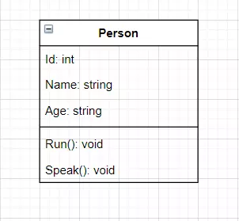
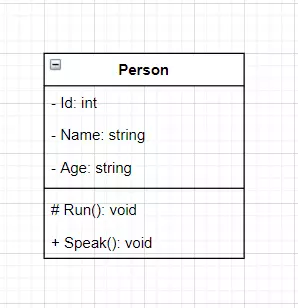
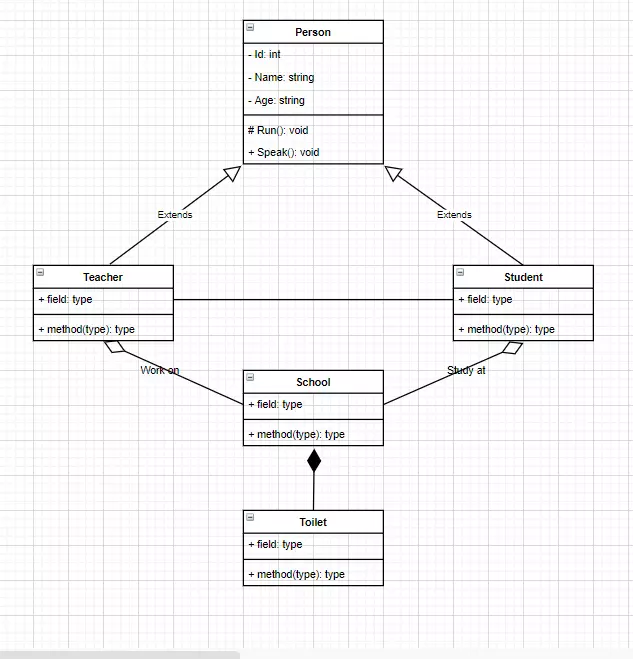
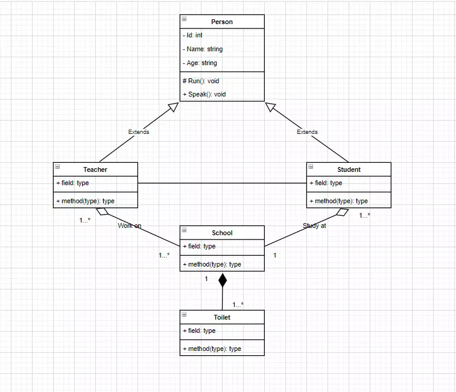
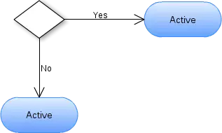
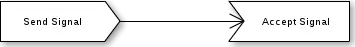
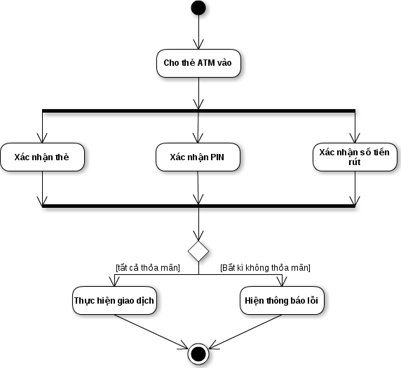

# DEV THÌ KHÔNG CHỈ VIẾT CODE
## 1. Version Control
- **Version control** (hay còn gọi là quản lý phiên bản) là một hệ thống để ghi lại và theo dõi các thay đổi trong mã nguồn, tài liệu hoặc bất kỳ tệp tin nào. Nó cho phép các nhóm làm việc cùng nhau trên cùng một dự án mà không gặp xung đột hoặc mất dữ liệu.
- Hệ thống quản lý phiên bản giữ một lịch sử của các phiên bản khác nhau của một tệp tin và ghi lại các thay đổi được thực hiện trên từng phiên bản. Điều này cho phép người dùng xem lại, so sánh và khôi phục các phiên bản trước đó một cách dễ dàng.
- Version control đóng vai trò quan trọng trong quá trình phát triển phần mềm và quản lý dự án vì các lý do sau:

  - Theo dõi lịch sử: Version control cho phép theo dõi lịch sử của mã nguồn và các tệp tin. Mỗi lần thay đổi được ghi lại, bao gồm thông tin về người thực hiện, thời gian và nội dung thay đổi. Điều này giúp người dùng xem lại và khôi phục các phiên bản trước đó nếu cần thiết, đồng thời cung cấp một lịch sử rõ ràng về sự phát triển của dự án.

  - Quản lý phiên bản: Version control cho phép tạo và quản lý các phiên bản khác nhau của dự án. Điều này giúp phát triển dự án theo các nhánh riêng biệt, như các tính năng mới, sửa lỗi hoặc các phiên bản ổn định. Quản lý phiên bản giúp các nhóm làm việc cùng nhau một cách hiệu quả và tránh xung đột khi làm việc trên cùng một tệp tin.

  - Hợp nhất công việc: Version control cho phép nhiều người cùng làm việc trên cùng một dự án mà không làm mất công việc của nhau. Các thay đổi được ghi lại và hợp nhất lại một cách tự động hoặc thủ công. Điều này giúp ngăn chặn xung đột và đảm bảo rằng mọi người đang làm việc trên phiên bản mới nhất của dự án.

  - Ghi lại thay đổi và xem xét: Version control cung cấp một phương tiện để ghi lại và xem xét các thay đổi. Điều này hữu ích trong việc kiểm tra lại các thay đổi đã được thực hiện và đảm bảo rằng mã nguồn hoặc tệp tin không bị mất hoặc bị thay đổi một cách không mong muốn.

  - Hỗ trợ làm việc nhóm: Version control cho phép nhiều thành viên trong nhóm làm việc cùng nhau trên cùng một dự án mà không gặp xung đột. Nó cung cấp khả năng chia sẻ và đồng bộ hóa mã nguồn và tệp tin giữa các thành viên và giúp quản lý phiên bản và các thay đổi.

  >Tổng cộng, version control giúp tăng cường quản lý và theo dõi các thay đổi trong quá trình phát triển phần mềm và hỗ trợ làm việc nhóm hiệu quả. Nó cung cấp lịch sử, quản lý phiên bản và khả năng hợp nhất công việc, giúp đảm bảo tính nhất quán và kiểm soát trong quá trình phát triển dự án.
## 2. Git
> Link tham khảo: [Git](https://topdev.vn/blog/git-la-gi/)
- Git là một hệ thống VCS (Version Control System) dùng để quản lý và kiểm tra các phiên bản source code khác nhau trong quá trình phát triển.
- Các thuật ngữ trong Git:
  - **Local Repository**: Local Repository (Kho lưu trữ cục bộ) là phiên bản của dự án được lưu trữ trên máy tính cá nhân. Nó bao gồm tất cả các thông tin về lịch sử thay đổi, các nhánh (branches), và các phiên bản của dự án.

  - **Remote Repository**: Remote Repository (Kho lưu trữ từ xa) là phiên bản của dự án được lưu trữ trên một máy chủ từ xa, thường là trên một dịch vụ như GitHub, GitLab hoặc Bitbucket. Remote Repository được sử dụng để chia sẻ và làm việc cùng nhau trên dự án với các thành viên khác trong nhóm.

  - **Branch**: Branch (Nhánh) là một phiên bản riêng biệt của dự án, tách ra từ nhánh chính (thường là nhánh master) để phát triển tính năng mới hoặc sửa lỗi mà không ảnh hưởng đến nhánh chính. Mỗi nhánh có lịch sử thay đổi riêng và có thể được hợp nhất lại (merge) vào nhánh chính hoặc các nhánh khác.

  - **Commit**: Commit là hành động ghi lại một bản sao lưu của tệp tin hoặc thay đổi được thực hiện trong Local Repository. Mỗi commit đi kèm với một thông điệp mô tả về những thay đổi đã được thực hiện. Các commit tạo thành lịch sử thay đổi của dự án.

  - **Merge**: Merge (Hợp nhất) là quá trình kết hợp các thay đổi từ một nhánh khác vào nhánh hiện tại. Khi hai nhánh có cùng nguồn gốc, merge được sử dụng để tích hợp các thay đổi từ nhánh phụ vào nhánh chính.

  - **Pull**: Pull (Kéo) là quá trình cập nhật Local Repository từ Remote Repository. Khi sử dụng lệnh pull, các thay đổi mới nhất từ Remote Repository được kéo về và hợp nhất vào Local Repository.

  - **Push**: Push (Đẩy) là quá trình cập nhật Remote Repository từ Local Repository. Khi sử dụng lệnh push, các thay đổi đã được commit trong Local Repository được đẩy lên Remote Repository để chia sẻ với những người khác trong nhóm.

  - **Clone**: Clone (Sao chép) là quá trình tạo ra một bản sao đầy đủ của một Remote Repository trên máy tính cá nhân. Khi một Repository được clone, bạn sẽ có một bản sao của toàn bộ lịch sử, nhánh và các tệp tin từ Remote Repository.

  - **Fork**: Fork (Nhánh phụ) là quá trình tạo ra một bản sao độc lập của một Remote Repository trên tài khoản cá nhân của bạn. Điều này cho phép bạn làm việc trên dự án mà không ảnh hưởng đến phiên bản gốc và sau đó gửi yêu cầu hợp nhất (pull request) để đóng góp vào dự án gốc.
### 2.1 Pull Request
> Link tham khảo: [Tạo Pull Request](https://s.pro.vn/tYAl)
- Pull Request được sử dụng khi bạn muốn đóng góp vào một dự án mà bạn đã fork (nhánh phụ) từ một Remote Repository. Pull Request cho phép bạn gửi yêu cầu để những thay đổi mà bạn đã thực hiện trong fork của mình được hợp nhất vào dự án gốc.
- Dưới đây là các bước để tạo Pull Request trên GitHub:

  - **Fork Repository**: Trước tiên, bạn cần fork (nhánh phụ) Remote Repository mà bạn muốn đóng góp. Điều này sẽ tạo ra một bản sao của dự án trên tài khoản GitHub cá nhân của bạn.

  - **Clone Repository**: Sau khi đã fork repository, clone (sao chép) repository fork của bạn về máy tính cá nhân của bạn. Điều này sẽ tạo ra một phiên bản Local Repository để làm việc.
    - Sao chép URL của repository.
    - Mở Terminal và sử dụng lệnh **git clone [URL]** để clone dự án về máy.

  - **Tạo nhánh**: Tạo một nhánh mới trong Local Repository để làm việc trên các thay đổi của bạn. Điều này sẽ giữ cho các thay đổi của bạn riêng biệt và dễ quản lý.
    - Mở Terminal trong thư mục dự án đã clone.
    - Sử dụng lệnh **git checkout -b [tên_nhánh]** để tạo và chuyển đổi sang một nhánh mới.

  - **Thực hiện thay đổi**: Thực hiện các thay đổi trong Local Repository như thêm, sửa hoặc xóa các tệp tin của bạn.

  - **Commit và Push thay đổi**: Push (đẩy) nhánh của bạn cùng với các thay đổi lên Remote Repository của bạn trên GitHub.
    - Mở Terminal và sử dụng lệnh git add . để thêm các thay đổi vào danh sách commit.
    - Sử dụng lệnh **git commit -m "Mô tả commit"**để commit các thay đổi đã thêm.
    - Sử dụng lệnh **git push origin [tên_nhánh]** để đẩy thay đổi lên repository của bạn trên GitHub.
  
  - **Tạo Pull Request**: Trên trang GitHub của Repository fork của bạn, bạn sẽ thấy một nút "New pull request" hoặc tương tự. Nhấp vào nút đó để chuyển đến trang tạo Pull Request.

  - **So sánh và kiểm tra**: Ở trang tạo Pull Request, hãy đảm bảo rằng nhánh của bạn và nhánh chính (thường là nhánh master) của dự án gốc đã được chọn để so sánh. Xem lại các thay đổi và đảm bảo rằng mọi thứ đều đúng trước khi tạo Pull Request.

  - **Tạo Pull Request**: Khi bạn đã kiểm tra và chắc chắn rằng mọi thứ đều ổn, nhấp vào nút "Create pull request" để tạo Pull Request. Hãy cung cấp một tiêu đề và mô tả cho Pull Request của bạn để giải thích các thay đổi và mục tiêu của bạn.

  - **Đợi xem xét và hợp nhất**: Sau khi bạn đã tạo Pull Request, những người quản lý dự án hoặc các thành viên khác trong nhóm sẽ xem xét và thảo luận về các thay đổi của bạn. Nếu thay đổi được chấp nhận, nó sẽ được hợp nhất vào dự án gốc.
## 3. UML
- **UML (Unified Modeling Language)** llà một ngôn ngữ mô hình hóa thống nhẩt được sử dụng để biểu diễn và mô tả các khía cạnh khác nhau của một hệ thống hoặc phần mềm.
- UML cung cấp một bộ các biểu đồ và biểu đồ mô tả có cấu trúc để hiển thị các phần khác nhau của hệ thống, bao gồm kiến trúc, hành vi, quy trình làm việc, và tương tác giữa các thành phần. Dựa trên nguyên tắc mô hình hóa, UML giúp đảm bảo rằng tất cả các bên liên quan đều có một cái nhìn chung về cách hệ thống hoạt động, từ đó tạo điều kiện thuận lợi cho việc phát triển và quản lý dự án.
- Các Loại Biểu Đồ UML Phổ Biến:
  - **Biểu Đồ Lớp (Class Diagrams)**: Được sử dụng để mô hình hóa cấu trúc của hệ thống, bao gồm các lớp, thuộc tính, và phương thức.
  - **Biểu Đồ Hoạt Động (Activity Diagrams)**: Mô tả các hoạt động và luồng làm việc trong hệ thống.
  - **Biểu Đồ Chuỗi (Sequence Diagrams)**: Biểu diễn các tương tác giữa các đối tượng trong thời gian thực.
  - **Biểu Đồ Trạng Thái (State Diagrams)**: Mô hình hóa các trạng thái và chuyển đổi giữa chúng trong hệ thống.
  - **Biểu Đồ Giao Tiếp (Communication Diagrams)**: Tương tự biểu đồ chuỗi, nhưng tập trung vào các tương tác giữa các đối tượng.
  - **Biểu Đồ Gói (Package Diagrams)**: Mô tả cách các phần mềm phân chia thành các gói (packages) để dễ quản lý.
  -** Biểu Đồ Mô tả Giao Tiếp (Communication Overview Diagrams)**: Mô hình hóa tương tác giữa các đối tượng và các tương tác bên trong hệ thống.

- Lí do cần vẽ UML trong quá trình phát triển phần mềm bao gồm:

  - *Định rõ yêu cầu*: Biểu đồ UML giúp hiểu và xác định yêu cầu của hệ thống phần mềm. Bằng cách sử dụng biểu đồ Use Case, các tác nhân và chức năng của hệ thống có thể được xác định một cách rõ ràng.

  - *Thiết kế hệ thống*: UML cung cấp các biểu đồ như Class Diagram, Sequence Diagram, State Diagram, và Activity Diagram để mô tả cấu trúc và luồng công việc của hệ thống. Sử dụng các biểu đồ này, các nhà phát triển có thể thiết kế và tổ chức hệ thống một cách logic và hiệu quả.

  - *Giao tiếp và truyền thông*: UML cung cấp một ngôn ngữ chung để giao tiếp giữa các thành viên trong nhóm phát triển phần mềm. Bằng cách sử dụng biểu đồ UML, các lập trình viên, kiến trúc sư và các bên liên quan khác có thể hiểu và truyền đạt thông tin về hệ thống một cách rõ ràng và một cách thống nhất.

  - *Kiểm tra và phân tích*: Biểu đồ UML có thể được sử dụng để phân tích và kiểm tra tính toàn vẹn và tính khả thi của hệ thống. Bằng cách mô phỏng các tình huống và tương tác giữa các thành phần, các vấn đề tiềm ẩn có thể được phát hiện và khắc phục trước khi triển khai.

  - *Tài liệu hóa*: UML cung cấp một cách tiêu chuẩn để tạo tài liệu về hệ thống phần mềm. Các biểu đồ và ký hiệu UML giúp tạo ra tài liệu chi tiết và dễ hiểu để mô tả hệ thống cho các nhà phát triển và người dùng cuối.

  - Vẽ UML giúp tăng tính minh bạch, sự hiểu biết và quản lý trong quá trình phát triển phần mềm. Nó giúp tạo ra một mô hình chung để mọi người có thể cùng làm việc và hiểu rõ về hệ thống phần mềm đang được phát triển.

### 3.1 Class Diagram (Biểu đồ lớp):
> Link tham khảo :[Class Diagram](https://viblo.asia/p/tim-hieu-ve-cach-thiet-ke-class-diagram-L4x5xLyY5BM)
- **Class Diagram** được sử dụng để mô tả cấu trúc tĩnh của hệ thống phần mềm, bao gồm các lớp, thuộc tính, phương thức và mối quan hệ giữa chúng. Class Diagram cho thấy cách các lớp tương tác với nhau trong hệ thống và mô tả các quan hệ như kế thừa, liên kết, gắn kết và tổng hợp.
  - Trong Class Diagram, mỗi lớp được biểu diễn bằng một hình chữ nhật với tên lớp ở phía trên, danh sách thuộc tính ở phía giữa và danh sách phương thức ở phía dưới. Mối quan hệ giữa các lớp được biểu diễn bằng các mũi tên và các ký hiệu như ký hiệu kế thừa, liên kết và gắn kết.
  - **Các tính chất cơ bản của class diagram**
      - **Tên class**
      - **Attribute (field, property)**
      - **Operation (method, function)**
    Ví dụ khai báo tên, attribute, operation kèm theo kiểu trả về của 1 class:
    
  - **Access Modifier trong class diagram**
    - Sử dụng để đặc tả phạm vi truy cập cho các Attribute và Operation của 1 class (Cấp quyền cho các class khác sử dụng Attribute và Operation của class này).
    - 4 lựa chọn phạm vi truy cập
      - Private ( - ): Chỉnh mình các đối tượng được tạo từ class này có thể sử dụng.
      - Public ( + ): Mọi đối tượng đều có thể sử dụng.
      - Protected ( # ): Chỉ các đối tượng được tạo từ class này và class kế thừa từ class này có thể sử dụng.
      - Package/Default: Các đối tượng được tạo từ class trong lớp cùng gói có thể sử dụng.
      
  - **Relationship trong class diagram**
    - Sử dụng để thể hiện mỗi quan hệ giữa đối tượng được tạo từ 1 class với các đối tượng được tạo từ class khác trong class diagram.
    - 4 loại Relationship:
      - **Inheritance**: 1 class kế thừa từ 1 class khác.
      - **Association**: 2 class có liên hệ với nhau nhưng không chỉ rõ mối liên hệ.
      - **Composition**: Đối tượng tạo từ class A mất thì đối tượng tạo từ class B sẽ mất.
      - **Agreegation**: Đối tượng tạo từ class A mất thì đối tượng tạo từ class B vẫn tồn tại độc lập.
      
  - **Multiplicity trong class diagram**
    - Sử dụng để thể hiện quan hệ về số lượng giữa các đối tượng được tạo từ các class trong class diagram
      - 0...1: 0 hoặc 1
      - n : Bắt buộc có n
      - 0...* : 0 hoặc nhiều
      - 1...* : 1 hoặc nhiều
      - m...n: có tối thiểu là m và tối đa là n
    
  - Class Diagram giúp hiểu rõ cấu trúc của hệ thống, quan hệ giữa các đối tượng và cung cấp một cơ sở để triển khai mã.
### 3.2 Activity Diagram (Biểu đồ hoạt động):
> Link tham khảo: [Activity Diagram](https://viblo.asia/p/phan-tich-thiet-ke-he-thong-thong-tin-su-dung-bieu-do-uml-phan-2-0bDM6wpAG2X4)
- **Activity Diagram** được sử dụng để mô tả luồng công việc hoặc quy trình trong hệ thống phần mềm. Nó cho thấy các hoạt động, hành động, quyết định và cấu trúc điều khiển của quy trình đó.
  - Trong Activity Diagram, các hoạt động được biểu diễn bằng các hình chữ nhật, các quyết định được biểu diễn bằng các hình rombus và các sự kiện bắt đầu và kết thúc được biểu diễn bằng các hình tròn. Các luồng công việc được biểu diễn bằng các mũi tên và các ký hiệu như fork (phân nhánh) và join (hợp nhất) để biểu thị sự chia nhánh và hợp nhất của luồng công việc.
  - Các thành phần của biểu đồ hoạt động
    - Trạng thái khởi tạo hoặc điểm bắt đầu (Initial State or Start Point)

       
    - Hoạt động hoặc trạng thái hoạt động (Activity or Action State)

      
    - Nút quyết định và rẽ nhánh
      - Nút rẽ nhánh trong biểu đồ hoạt động được kí hiệu bằng hình thoi màu trắng.

         
    - Thanh tương tranh hay thanh đồng bộ
      - Có thể có nhiều luồng hành động được bắt đầu thực hiện hay kết thúc đồng thời trong hệ thống.
        - Thanh đồng bộ kết hợp:

          
        - Thanh đồng bộ chia nhánh:

           
      - Cạnh gián đoạn (Interrupting Edge)

        
      - Luồng hoạt động (Action Folow)

        
      - Phân làn (Swimlanes)
        - Phân làn trong biểu đồ sử dụng là những đường nét đứt thẳng đứng theo các đối tượng. Phần kí hiệu này thường được sử dụng để làm rõ luồng hoạt động của các đối tượng riêng biệt.
        - Thời gian sự kiện (Time Event)

          
        - Gửi và nhận tín hiệu (Sent and Received Signals)
          
          
        - Trạng thái kết thúc hoặc điểm cuối (Final State or End Point)

          
    - Ví dụ: Biểu đồ hoạt động rút tiền tại cây ATM:

       
  - Activity Diagram giúp hiểu rõ các quy trình trong hệ thống, các điều kiện và quyết định trên đường đi của quy trình, và cung cấp một cách trực quan để kiểm tra và phân tích luồng công việc.
