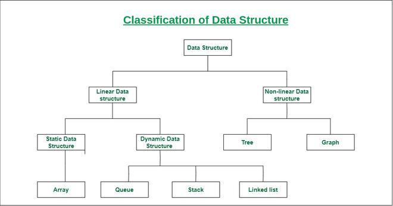
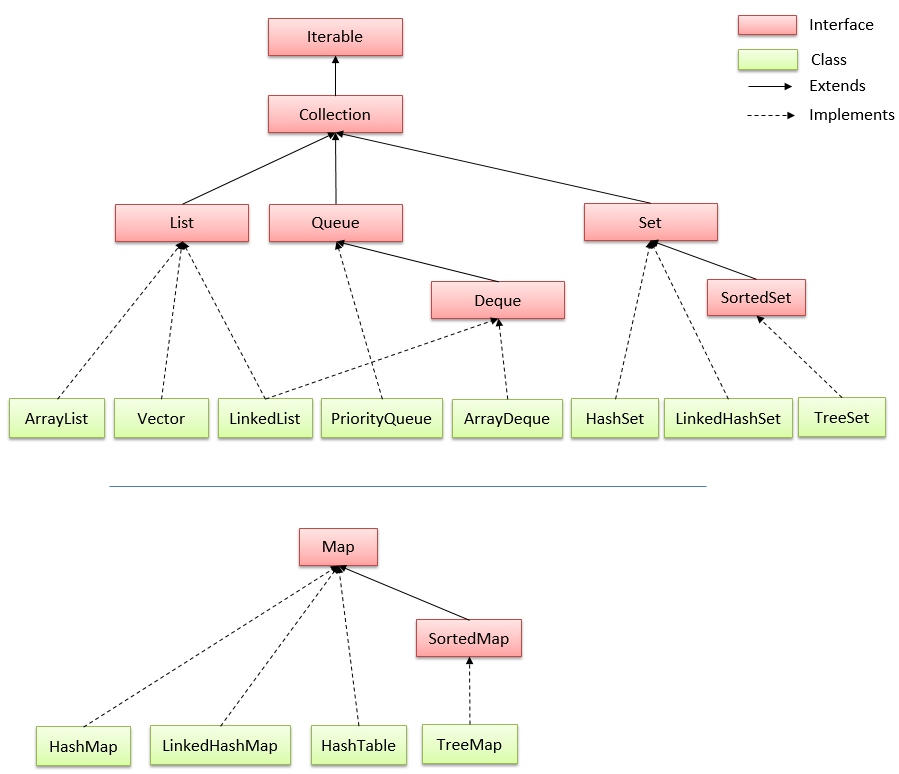
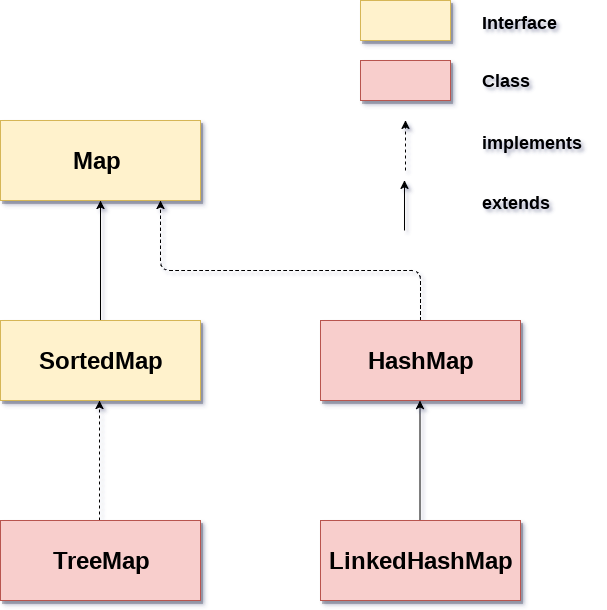

# MỘT SỐ CẤU TRÚC DỮ LIỆU THƯỜNG THẤY TRONG JAVA

## 1. Cấu trúc dữ liệu
### 1.1 Định nghĩa:
- **Cấu trúc dữ liệu** là một cách tổ chức và lưu trữ dữ liệu trong máy tính để có thể truy cập và xử lý một cách hiệu quả. Cấu trúc dữ liệu giúp chúng ta tổ chức dữ liệu sao cho nó dễ dàng được lưu trữ, tìm kiếm, thêm, xóa và sắp xếp. Nó cung cấp một cách để biểu diễn quan hệ giữa các phần tử dữ liệu và các thao tác có thể được thực hiện trên dữ liệu đó.
- Có nhiều loại cấu trúc dữ liệu khác nhau được sử dụng trong lập trình, bao gồm:

    - **Mảng (Array):** Là một tập hợp các phần tử dữ liệu có cùng kiểu dữ liệu được lưu trữ liên tiếp trong bộ nhớ.

    - **Danh sách liên kết (Linked List):** Là một cấu trúc dữ liệu mà các phần tử dữ liệu được lưu trữ không liên tiếp trong bộ nhớ. Mỗi phần tử trong danh sách liên kết chứa dữ liệu và một con trỏ chỉ đến phần tử tiếp theo trong danh sách.

    - **Stack:** Là một cấu trúc dữ liệu tuân theo nguyên tắc "vào sau ra trước" (Last-In-First-Out). Các phần tử được thêm vào cuối của ngăn xếp được gọi là "đỉnh" và chỉ có thể truy cập được phần tử ở đỉnh.

    - **Queue:** Là một cấu trúc dữ liệu tuân theo nguyên tắc "vào trước ra trước" (First-In-First-Out). Các phần tử được thêm vào cuối hàng đợi được gọi là "đuôi", và chỉ có thể truy cập được phần tử ở đầu hàng đợi.

    - **Cây (Tree):** Là một cấu trúc dữ liệu phi tuyến tính có các phần tử dữ liệu được tổ chức theo cấu trúc phân cấp. Mỗi phần tử trong cây gọi là nút và có thể có các nút con phụ thuộc vào cấu trúc của cây.

    - **Đồ thị (Graph):** Là một cấu trúc dữ liệu biểu diễn một tập hợp các đối tượng (nút) và các mối quan hệ giữa chúng (cạnh). Đồ thị có thể là đồ thị vô hướng (không có hướng) hoặc đồ thị có hướng (có hướng).
    - **Bảng băm (Hash table):** Bản đồ băm hay bảng băm lưu trữ một bộ sưu tập các mục trong một bảng để vẽ các khóa cho giá trị. Nó sử dụng hàm băm để chuyển một chỉ mục thành một mảng các nhóm chứa dữ liệu mong muốn.
- **Cấu trúc dữ liệu có thể được phân thành hai loại lớn:**

    - **Cấu trúc dữ liệu tuyến tính:** Một cấu trúc dữ liệu trong đó các phần tử dữ liệu được sắp xếp tuần tự hoặc tuyến tính, trong đó mỗi phần tử được gắn với các phần tử liền kề trước đó và tiếp theo của nó, được gọi là cấu trúc dữ liệu tuyến tính. Ví dụ như mảng, ngăn xếp, hàng đợi, v.v.
    - **Cấu trúc dữ liệu phi tuyến tính:** Cấu trúc dữ liệu trong đó các phần tử dữ liệu không được đặt tuần tự hoặc tuyến tính được gọi là cấu trúc dữ liệu phi tuyến tính. Ví dụ như cây và đồ thị.
    
### 1.2 Sử dụng cấu trúc dữ liệu khi nào?
- Cấu trúc dữ liệu và giải thuật được sử dụng khi chúng ta cần giải quyết các vấn đề liên quan đến việc tổ chức, lưu trữ và xử lý dữ liệu trong lập trình. Dưới đây là một số tình huống mà cấu trúc dữ liệu và giải thuật thường được áp dụng:

    - Khi cần lưu trữ một lượng lớn dữ liệu và phải tìm kiếm, thêm, xóa hoặc sắp xếp dữ liệu một cách hiệu quả. Các cấu trúc dữ liệu như mảng, danh sách liên kết, cây, hoặc bảng băm có thể được sử dụng để quản lý dữ liệu một cách tối ưu.

    - Khi cần thực hiện các thao tác trên dữ liệu một cách hiệu quả. Các cấu trúc dữ liệu như stack và queue thường được sử dụng để thực hiện các thao tác như đẩy (push) và lấy (pop) phần tử một cách nhanh chóng.

    - Khi cần biểu diễn một quan hệ phức tạp giữa các đối tượng. Các cấu trúc dữ liệu như đồ thị được sử dụng để biểu diễn các mối quan hệ phức tạp giữa các đối tượng, chẳng hạn như mạng xã hội, mạng lưới giao thông, hoặc mạng máy tính.

    - Khi cần tìm kiếm, sắp xếp hoặc xử lý dữ liệu theo một tiêu chí cụ thể. Các giải thuật như tìm kiếm nhị phân, sắp xếp nhanh (quick sort), hoặc tìm kiếm đường đi ngắn nhất (shortest path) trong đồ thị thường được sử dụng để thực hiện các tác vụ xử lý dữ liệu phức tạp một cách nhanh chóng.

    - Khi cần tối ưu hóa hiệu suất và sử dụng tài nguyên một cách hiệu quả. Các cấu trúc dữ liệu và giải thuật có thể được thiết kế để tối ưu hóa việc sử dụng bộ nhớ, thời gian xử lý và các tài nguyên khác.
    > Tuy nhiên, việc sử dụng cấu trúc dữ liệu và giải thuật không phải lúc nào cũng là cần thiết. Trong một số trường hợp đơn giản, việc sử dụng cấu trúc dữ liệu và giải thuật phức tạp có thể không cần thiết và gây tốn tài nguyên. Việc lựa chọn cấu trúc dữ liệu và giải thuật phù hợp phụ thuộc vào đặcific vấn đề cần giải quyết và yêu cầu của ứng dụng.
- **Các ứng dụng của cấu trúc dữ liệu:**
    Cấu trúc dữ liệu được sử dụng trong một loạt các chương trình và ứng dụng máy tính, bao gồm:

    - **Cơ sở dữ liệu:** Cấu trúc dữ liệu được sử dụng để tổ chức và lưu trữ dữ liệu trong cơ sở dữ liệu, cho phép truy xuất và thao tác hiệu quả.
    - **Hệ điều hành:** Cấu trúc dữ liệu được sử dụng trong thiết kế và triển khai các hệ điều hành để quản lý tài nguyên hệ thống, chẳng hạn như bộ nhớ và tệp.
    - **Đồ họa máy tính:** Cấu trúc dữ liệu được sử dụng để biểu diễn các hình dạng hình học và các yếu tố đồ họa khác trong các ứng dụng đồ họa máy tính.
    - **Trí tuệ nhân tạo:** Cấu trúc dữ liệu được sử dụng để đại diện cho kiến thức và thông tin trong các hệ thống trí tuệ nhân tạo.
- **Ưu điểm của cấu trúc dữ liệu:**
    Việc sử dụng các cấu trúc dữ liệu cung cấp một số lợi thế, bao gồm:

    - **Hiệu quả:** Cấu trúc dữ liệu cho phép lưu trữ và truy xuất dữ liệu hiệu quả, điều này rất quan trọng trong các ứng dụng mà hiệu suất là rất quan trọng.
    - **Tính linh hoạt:** Cấu trúc dữ liệu cung cấp một cách linh hoạt để tổ chức và lưu trữ dữ liệu, cho phép dễ dàng sửa đổi và thao tác.
    - **Khả năng tái sử dụng:** Cấu trúc dữ liệu có thể được sử dụng trong nhiều chương trình và ứng dụng, giảm nhu cầu về mã dự phòng.
    - **Khả năng bảo trì:** Cấu trúc dữ liệu được thiết kế tốt có thể làm cho các chương trình dễ hiểu, sửa đổi và duy trì hơn theo thời gian.
## 2. Interface Iterable và Collection
### 2.1 Interface Iterable
- Giao diện Iterable là một trong những giao diện cốt lõi trong Java, nằm trong gói java.lang. Nó được sử dụng để duyệt qua các phần tử trong một tập hợp dữ liệu (collection) như mảng, danh sách liên kết, hoặc tập hợp (Set) một cách trừu tượng. 
- Giao diện này định nghĩa một phương thức duy nhất là Iterator<T> iterator(), nơi mà các lớp triển khai phải cung cấp một trình duyệt (iterator) để lặp qua các phần tử của tập hợp.
```Java
    public interface Iterable<T> {
        Iterator<T> iterator();
    }
```
> Ở đây, T là tham số kiểu dữ liệu (generic type parameter) đại diện cho kiểu dữ liệu của các phần tử trong tập hợp. Khi triển khai giao diện Iterable, bạn sẽ cần thực hiện phương thức iterator() để trả về một đối tượng Iterator.
- Đối tượng Iterator là một lớp riêng biệt và cũng là một giao diện có cùng tên, gọi là Iterator<T>, nơi T là kiểu dữ liệu của các phần tử trong tập hợp. Iterator cung cấp các phương thức như `hasNext()` để kiểm tra xem tập hợp có phần tử tiếp theo không, và `next()` để lấy phần tử tiếp theo trong tập hợp.
- Khi sử dụng Iterable và Iterator, có thể duyệt qua các phần tử của tập hợp một cách thuận tiện bằng cách sử dụng các cấu trúc lặp như vòng lặp while hoặc vòng lặp for-each (enhanced for loop).
- Ví dụ:
    ```Java
        import java.util.*;

        public class Main {
            public static void main(String[] args) {
                List<String> danhSach = new ArrayList<>();
                danhSach.add("Java");
                danhSach.add("Python");
                danhSach.add("C++");

                // Sử dụng Iterable và Iterator để duyệt qua danh sách liên kết
                Iterable<String> iterable = danhSach;
                Iterator<String> iterator = iterable.iterator();
                while (iterator.hasNext()) {
                    String phanTu = iterator.next();
                    System.out.println(phanTu);
                }
            }
        }
    // output:
    // Java
    // Python
    // C++
    ```
    > Sử dụng giao diện Iterable giúp cho việc duyệt qua các phần tử trong tập hợp dễ dàng và trừu tượng hơn, giúp tăng tính linh hoạt và tái sử dụng trong việc xử lý dữ liệu trong Java.
### 2.2 Collection
- **Collection** trong java là một root interface trong hệ thống cấp bậc Collection. Java Collection cung cấp nhiều interface (Set, List, Queue, Deque vv) và các lớp (ArrayList, Vector, LinkedList, PriorityQueue, HashSet, LinkedHashSet, TreeSet vv).
- **Hệ thống cấp bậc Collection trong Java:**

- **Một số interface chính của Collection:**
  - **1.List**
    - List là một tập hợp có thứ tự và có thể chứa các phần tử trùng lặp. Bạn có thể truy cập bất kỳ phần tử nào từ chỉ mục của nó. List giống mảng hơn với độ dài động. List là một trong những loại Collection được sử dụng nhiều nhất. ArrayList và LinkedList là các lớp thực thi của Interface List.
    - Các phương thức của interface List trong Java bao gồm: `size()`,`add()`,`addAll()`,`remove()`,`removeAll()`,`get()`,`set()`,`contains()`,`isEmpty()`,`indexOf()`,`lastIndexOf()`,`clear()`,`iterator()`,`toArray()`,...
    - Những lớp kế thừa List interface là **Arraylist**, **LinkedList**,**Vector**,**Stack**.
    - Ví dụ:
      ```Java
        import java.util.ArrayList;
        import java.util.List;

        public class ListExample {
            public static void main(String[] args) {
                // Tạo một đối tượng List kiểu String
                List<String> fruits = new ArrayList<>();

                // Thêm các phần tử vào danh sách
                fruits.add("Apple");
                fruits.add("Banana");
                fruits.add("Orange");
                fruits.add("Mango");

                // Hiển thị số lượng phần tử trong danh sách
                System.out.println("Số lượng phần tử trong danh sách: " + fruits.size());

                // Lặp qua danh sách và hiển thị các phần tử
                System.out.println("Các phần tử trong danh sách:");
                for (String fruit : fruits) {
                    System.out.println(fruit);
                }

                // Kiểm tra xem danh sách có chứa phần tử cụ thể không
                String searchFruit = "Apple";
                if (fruits.contains(searchFruit)) {
                    System.out.println(searchFruit + " có trong danh sách.");
                } else {
                    System.out.println(searchFruit + " không có trong danh sách.");
                }

                // Lấy phần tử từ danh sách theo chỉ mục
                String fruitAtIndex2 = fruits.get(2);
                System.out.println("Phần tử tại chỉ mục 2: " + fruitAtIndex2);

                // Thay thế phần tử trong danh sách
                fruits.set(1, "Grapes");
                System.out.println("Danh sách sau khi thay thế phần tử:");
                for (String fruit : fruits) {
                    System.out.println(fruit);
                }

                // Loại bỏ phần tử từ danh sách
                fruits.remove("Orange");
                System.out.println("Danh sách sau khi loại bỏ phần tử:");
                for (String fruit : fruits) {
                    System.out.println(fruit);
                }
            }
        }
        /*
        Số lượng phần tử trong danh sách: 4
        Các phần tử trong danh sách:
        Apple
        Banana
        Orange
        Mango
        Apple có trong danh sách.
        Phần tử tại chỉ mục 2: Orange
        Danh sách sau khi thay thế phần tử:
        Apple
        Grapes
        Orange
        Mango
        Danh sách sau khi loại bỏ phần tử:
        Apple
        Grapes
        Mango
        */
      ```
  - **2.Set**
    - Set là tập hợp không được chứa các phần tử trùng lặp. 
    - Interface này mô hình hóa sự trừu tượng hóa tập hợp toán học và được sử dụng để đại diện cho các tập hợp.
    - Các phương thức của interface Set trong Java:  `size()`,`add()`,`addAll()`,`remove()`,`removeAll()`,`get()`,`set()`,`contains()`,`isEmpty()`,`indexOf()`,`lastIndexOf()`,`clear()`,`iterator()`,`toArray()`,`hashCode()`,...
    - Set được triển khai bởi **Hashset**, **LinkedHashset**,**Treeset** hoặc 
    **EnumSet**
    - Ví dụ:
     ```Java
        import java.util.HashSet;
        import java.util.Set;

        public class SetExample {
            public static void main(String[] args) {
                // Tạo một đối tượng Set kiểu String
                Set<String> countries = new HashSet<>();

                // Thêm các phần tử vào tập hợp
                countries.add("Vietnam");
                countries.add("United States");
                countries.add("Japan");
                countries.add("France");
                countries.add("Germany");

                // Hiển thị số lượng phần tử trong tập hợp
                System.out.println("Số lượng phần tử trong tập hợp: " + countries.size());

                // Lặp qua tập hợp và hiển thị các phần tử
                System.out.println("Các phần tử trong tập hợp:");
                for (String country : countries) {
                    System.out.println(country);
                }

                // Kiểm tra xem tập hợp có chứa một phần tử cụ thể không
                String searchCountry = "Japan";
                if (countries.contains(searchCountry)) {
                    System.out.println(searchCountry + " có trong tập hợp.");
                } else {
                    System.out.println(searchCountry + " không có trong tập hợp.");
                }

                // Loại bỏ một phần tử từ tập hợp
                countries.remove("France");
                System.out.println("Tập hợp sau khi loại bỏ phần tử:");
                for (String country : countries) {
                    System.out.println(country);
                }
            }
        }
        /*
        Số lượng phần tử trong tập hợp: 5
        Các phần tử trong tập hợp:
        United States
        Germany
        Japan
        Vietnam
        France
        Japan có trong tập hợp.
        Tập hợp sau khi loại bỏ phần tử:
        United States
        Germany
        Japan
        Vietnam
        */
     ```
  - **3.Queue**
    - Queue đại diện cho một hàng đợi các phần tử và định nghĩa một tập hợp các phương thức để thực hiện các hoạt động liên quan đến hàng đợi như thêm, loại bỏ và truy cập các phần tử.
    - Một số phương thức quan trọng của Queue: 
      - `poll()`: Loại bỏ và trả về phần tử đầu tiên khỏi hàng đợi. Trả về null nếu hàng đợi rỗng.
      - `element()`: Trả về phần tử đầu tiên trong hàng đợi mà không loại bỏ nó. Nếu hàng đợi rỗng, nó sẽ ném ra một ngoại lệ.
      - `peek()`: Trả về phần tử đầu tiên trong hàng đợi mà không loại bỏ nó. Trả về null nếu hàng đợi rỗng.
      - `offer()`: Thêm một phần tử vào hàng đợi. Trả về true nếu thêm thành công và false nếu hàng đợi đã đầy.
      - `add()`: Thêm một phần tử vào hàng đợi. Nếu không thể thêm phần tử (vì hàng đợi đã đầy), nó sẽ ném ra một ngoại lệ.
    - Một số lớp triển khai của interface Queue trong Java: **LinkedList**,**PriorityQueue**,**ArrayBlockingQueue**,**DelayQueue**,**LinkedBlockingQueue**,**AbstractQueue**,**PriorityBlockingQueue**,...
    - Ví dụ:
      ```Java
        import java.util.LinkedList;
        import java.util.Queue;

        public class QueueExample {
            public static void main(String[] args) {
                // Tạo một đối tượng Queue kiểu String
                Queue<String> queue = new LinkedList<>();

                // Thêm các phần tử vào hàng đợi
                queue.add("Element 1");
                queue.add("Element 2");
                queue.add("Element 3");
                queue.add("Element 4");

                // Hiển thị hàng đợi
                System.out.println("Hàng đợi ban đầu: " + queue);

                // Loại bỏ phần tử đầu tiên khỏi hàng đợi
                String removedElement = queue.remove();
                System.out.println("Phần tử đã loại bỏ: " + removedElement);
                System.out.println("Hàng đợi sau khi loại bỏ: " + queue);

                // Truy cập phần tử đầu tiên trong hàng đợi
                String firstElement = queue.peek();
                System.out.println("Phần tử đầu tiên: " + firstElement);
                System.out.println("Hàng đợi sau khi truy cập: " + queue);
            }
        }
        /*
        Hàng đợi ban đầu: [Element 1, Element 2, Element 3, Element 4]
        Phần tử đã loại bỏ: Element 1
        Hàng đợi sau khi loại bỏ: [Element 2, Element 3, Element 4]
        Phần tử đầu tiên: Element 2
        Hàng đợi sau khi truy cập: [Element 2, Element 3, Element 4]
        */
      ```
## 3. Interface Map và SortedMap
### 3.1 Interface Map
- Trong java, map được sử dụng để lưu trữ và truy xuất dữ liệu theo cặp **key** và **value**. Mỗi cặp key và value được gọi là mục nhập (entry). - Map trong java chỉ chứa các giá trị key duy nhất. Map rất hữu ích nếu bạn phải tìm kiếm, cập nhật hoặc xóa các phần tử trên dựa vào các key.
 

- Các phương thức hữu ích của interface Map trong Java: 
  - **Object put(Object key, Object value):** Nó được sử dụng để chèn một mục nhập trong map hiện tại.
  - **void putAll(Map map):** Nó được sử dụng để chèn map chỉ định vào map hiện tại.
  - **Object remove(Object key):** Nó được sử dụng để xóa một mục nhập của key được chỉ định.
  - **Object get(Object key):** Nó được sử dụng để trả lại giá trị cho khoá được chỉ định.
  - **boolean containsKey(Object key):** Nó được sử dụng để tìm kiếm key được chỉ định từ map hiện tại.
  - **Set keySet():** Nó được sử dụng để trả đối tượng Set có chứa tất cả các keys.
  - **Set entrySet():** Nó được sử dụng để trả lại đối tượng Set có chứa tất cả các keys và values.
- Ví dụ: 
    ```Java
        import java.util.HashMap;
        import java.util.Map;
        import java.util.Set;
        
        public class MapExample1 {
            public static void main(String args[]) {
                // init map
                Map<Integer, String> map = new HashMap<Integer, String>();
                map.put(100, "A");
                map.put(101, "B");
                map.put(102, "C");
                // show map
                Set<Integer> set = map.keySet();
                for (Integer key : set) {
                    System.out.println(key + " " + map.get(key));
                }
            }
        }
        /*
        100 A
        101 B
        102 C
        */
    ```
- **Map.Entry Interface** : Entry là một interface con của Map. Vì vậy, chúng ta được truy cập nó bằng tên Map.Entry. Nó cung cấp các phương pháp để truy xuất các key và value.
  - Object getKey(): Nó được dùng để lấy key.
  - Object getValue(): Nó được sử dụng để lấy value.
### 3.2 SortedMap
- **SortedMap** đại diện cho một cấu trúc dữ liệu ánh xạ (mapping) giữa các cặp khóa (key) và giá trị (value) được sắp xếp theo thứ tự tăng dần của khóa.
- SortedMap bổ sung các phương thức liên quan đến việc làm việc với các phần tử được sắp xếp trong Map. 
  - **Comparator<? super K> comparator():** Trả về bộ so sánh (comparator) được sử dụng để sắp xếp các khóa trong SortedMap. Nếu SortedMap được tạo mà không chỉ định bộ so sánh, phương thức này trả về null.
  - **SortedMap<K, V> subMap(K fromKey, K toKey):** Trả về một SortedMap con chứa các entry nằm giữa fromKey (bao gồm) và toKey (không bao gồm) của SortedMap gốc.
  - **SortedMap<K, V> headMap(K toKey):** Trả về một SortedMap con chứa tất cả các entry có khóa nhỏ hơn toKey của SortedMap gốc.
  - **SortedMap<K, V> tailMap(K fromKey):** Trả về một SortedMap con chứa tất cả các entry có khóa lớn hơn hoặc bằng fromKey của SortedMap gốc.
  - **K firstKey():** Trả về khóa nhỏ nhất trong SortedMap.
  - **K lastKey():** Trả về khóa lớn nhất trong SortedMap.
- Ví dụ:
    ```Java
    import java.util.SortedMap;
    import java.util.TreeMap;

    public class SortedMapExample {
        public static void main(String[] args) {
            // Tạo một đối tượng SortedMap kiểu Integer làm khóa và String làm giá trị
            SortedMap<Integer, String> studentGrades = new TreeMap<>();

            // Thêm các entry vào SortedMap
            studentGrades.put(75, "Alice");
            studentGrades.put(80, "Bob");
            studentGrades.put(85, "Charlie");
            studentGrades.put(90, "David");

            // Truy cập giá trị bằng khóa
            int grade = 80;
            String student = studentGrades.get(grade);
            System.out.println("Học sinh có điểm " + grade + ": " + student);

            // Truy cập khóa nhỏ nhất và lớn nhất
            int lowestGrade = studentGrades.firstKey();
            int highestGrade = studentGrades.lastKey();
            System.out.println("Điểm thấp nhất: " + lowestGrade);
            System.out.println("Điểm cao nhất: " + highestGrade);

            // Hiển thị các entry trong SortedMap
            System.out.println("Các entry trong SortedMap:");
            for (SortedMap.Entry<Integer, String> entry : studentGrades.entrySet()) {
                int gradeKey = entry.getKey();
                String studentValue = entry.getValue();
                System.out.println("Điểm: " + gradeKey + ", Học sinh: " + studentValue);
            }
        }
    }
    /*
    Học sinh có điểm 80: Bob
    Điểm thấp nhất: 75
    Điểm cao nhất: 90
    Các entry trong SortedMap:
    Điểm: 75, Học sinh: Alice
    Điểm: 80, Học sinh: Bob
    Điểm:85, Học sinh: Charlie
    Điểm: 90, Học sinh: David
    
    */
    ``` 
- **1.HashMap**
  - Lớp HashMap trong java là một lớp kế thừa lớp AbstractMap và triển khai của Map Interface trong Collections Framework nên nó sẽ có một vài đặc điểm và phương thức tương đồng với Map. HashMap được sử dụng để lưu trữ các phần tử dưới dạng "key/value". Key và value là kiểu dữ liệu bất kỳ, và bạn có thể try cập các giá trị của HasMap bằng một key cụ thể.
- Những điểm quan trọng về lớp HashMap trong java là:

    - HashMap lưu trữ dữ liệu dưới dạng cặp key và value.
    - Nó chứa các key duy nhất.
    - Nó có thể có 1 key là null và nhiều giá trị null.
    - Nó duy trì các phần tử KHÔNG theo thứ tự.

- **2.TreeMap**
  - **TreeMap** là một lớp triển khai của giao diện SortedMap trong Java vậy nên sẽ có một vài đặc điểm và phương thức tương đồng với Map và SortedMap
  - Một số đặc điểm quan trọng của TreeMap bao gồm:
        - TreeMap không cho phép null làm khóa (key). Tuy nhiên, các giá trị (value) có thể là null.
        - TreeMap sắp xếp các entry dựa trên thứ tự tăng dần của khóa dựa trên triển khai của giao diện Comparable hoặc thông qua một Comparator được chỉ định trong quá trình khởi tạo.
        - TreeMap có hiệu suất tương đối tốt trong việc tìm kiếm, chèn và xóa các entry. Thời gian truy cập các entry là logarithmic (O(log n)).
  - Ví dụ:
    ```Java
    import java.util.TreeMap;
    import java.util.Map;

    public class TreeMapExample {
        public static void main(String[] args) {
            // Tạo một đối tượng TreeMap kiểu Integer làm khóa và String làm giá trị
            TreeMap<Integer, String> studentMap = new TreeMap<>();

            // Thêm các entry vào TreeMap
            studentMap.put(3, "Alice");
            studentMap.put(1, "Bob");
            studentMap.put(2, "Charlie");

            // Truy cập giá trị bằng khóa
            int studentId = 2;
            String studentName = studentMap.get(studentId);
            System.out.println("Học sinh có mã số " + studentId + ": " + studentName);

            // Kiểm tra sự tồn tại của một khóa trong TreeMap
            int invalidStudentId = 4;
            boolean containsKey = studentMap.containsKey(invalidStudentId);
            System.out.println("Có tồn tại học sinh có mã số " + invalidStudentId + ": " + containsKey);

            // Xóa một entry khỏi TreeMap
            int removedStudentId = 3;
            String removedStudentName = studentMap.remove(removedStudentId);
            System.out.println("Học sinh có mã số " + removedStudentId + " đã bị xóa: " + removedStudentName);

            // Hiển thị tất cả các entry trong TreeMap
            System.out.println("Các entry trong TreeMap:");
            for (Map.Entry<Integer, String> entry : studentMap.entrySet()) {
                int id = entry.getKey();
                String name = entry.getValue();
                System.out.println("Mã số: " + id + ", Học sinh: " + name);
            }
        }
    }
    /*
    Học sinh có mã số 2: Charlie
    Có tồn tại học sinh có mã số 4: false
    Học sinh có mã số 3 đã bị xóa: Alice
    Các entry trong TreeMap:
    Mã số: 1, Học sinh: Bob
    Mã số: 2, Học sinh: Charlie
    */
    ```
    >Trong ví dụ này, chúng ta sử dụng TreeMap để tạo một SortedMap với khóa kiểu Integer và giá trị kiểu String. Chúng ta thêm các entry vào TreeMap, truy cập giá trị bằng khóa sử dụng get(), kiểm tra sự tồn tại của một khóa sử dụng containsKey(), xóa một entry khỏi TreeMap sử dụng remove(), và hiển thị tất cả các entry trong TreeMap sử dụng vòng lặp qua entrySet(). Bởi vì TreeMap triển khai giao diện SortedMap, các entry trong TreeMap sẽ được sắp xếp theo thứ tự tăng dần.
## 4. Sorting trong Collections
### 4.1 Sắp xếp một List: 
- Đối với một List (ví dụ: ArrayList, LinkedList), ta có thể sử dụng phương thức `Collections.sort(List<T> list)` để sắp xếp các phần tử theo thứ tự tăng dần. 
- Ví dụ:
    ```Java
    List<Integer> numbers = new ArrayList<>();
    numbers.add(3);
    numbers.add(1);
    numbers.add(2);

    Collections.sort(numbers);
    System.out.println(numbers); // Output: [1, 2, 3]
    
    ```
### 4.2 Sắp xếp một List theo một tiêu chí cụ thể:
- Để sắp xếp một List theo một tiêu chí cụ thể, ta có thể sử dụng phương thức Collections.sort(List<T> list, Comparator<? super T> c) và truyền một Comparator vào. 
- Ví dụ:
    ```Java
    List<String> names = new ArrayList<>();
    names.add("A");
    names.add("B");
    names.add("C");

    Collections.sort(names, (a, b) -> a.compareTo(b));
    System.out.println(names); // Output: [A, B, C]
    ```
### 4.3 Sắp xếp một Set:
- Đối với một Set (ví dụ: HashSet, TreeSet), ta không thể trực tiếp sử dụng `Collections.sort()` vì Set không giữ thứ tự. Tuy nhiên, ta có thể chuyển Set thành một List, sau đó sử dụng `Collections.sort()` để sắp xếp. 
- Ví dụ:
    ```Java
    Set<Integer> numbers = new HashSet<>();
    numbers.add(3);
    numbers.add(1);
    numbers.add(2);

    List<Integer> sortedNumbers = new ArrayList<>(numbers);
    Collections.sort(sortedNumbers);
    System.out.println(sortedNumbers); // Output: [1, 2, 3]
    ```
### 4.4 Đối với các đối tượng mà người dùng tự định nghĩa
- **Cách 1:** 
  - **Implement interface Comparable**: Đối tượng của bạn có thể implement interface Comparable và triển khai phương thức compareTo() để xác định cách so sánh với các đối tượng khác. 
  - Phương thức compareTo() trả về một số nguyên âm, 0 hoặc số nguyên dương tương ứng với kết quả so sánh giữa hai đối tượng.
  - Ví dụ: 
  ```Java
    public class Student implements Comparable<Student> {
        private String name;
        private int age;

        // constructors, getters, setters

        @Override
        public int compareTo(Student other) {
            // Sắp xếp theo tuổi tăng dần
            return this.age - other.age;
        }
    }
  ```
  - Sau đó, ta có thể sử dụng Collections.sort() hoặc List.sort() để sắp xếp các đối tượng:
  ```Java
    List<Student> students = new ArrayList<>();
    students.add(new Student("Alice", 20));
    students.add(new Student("Bob", 18));
    students.add(new Student("Charlie", 22));

    Collections.sort(students);
    // Hoặc students.sort();

    for (Student student : students) {
        System.out.println(student.getName() + " - " + student.getAge());
    }

  ```
- **Cách 2:** 
  - Sử dụng một đối tượng Comparator: Nếu bạn không muốn thay đổi lớp đối tượng gốc hoặc muốn sắp xếp theo nhiều tiêu chí khác nhau, bạn có thể triển khai một đối tượng Comparator riêng biệt để xác định cách so sánh. Đối tượng Comparator triển khai phương thức compare() để so sánh hai đối tượng. 
  - Ví dụ:
  ```Java
    public class StudentComparator implements Comparator<Student> {
        @Override
        public int compare(Student s1, Student s2) {
            // Sắp xếp theo tên tăng dần
            return s1.getName().compareTo(s2.getName());
        }
    }
  ```
  - Sau đó, bạn có thể sử dụng Collections.sort() hoặc List.sort() và truyền một đối tượng Comparator:
  ```Java
    List<Student> students = new ArrayList<>();
    students.add(new Student("Alice", 20));
    students.add(new Student("Bob", 18));
    students.add(new Student("Charlie", 22));

    Comparator<Student> comparator = new StudentComparator();
    Collections.sort(students, comparator);
    // Hoặc students.sort(comparator);

    for (Student student : students) {
        System.out.println(student.getName() + " - " + student.getAge());
    }
  ```
  - Ví dụ đầy đủ:
  ```Java
    import java.util.ArrayList;
    import java.util.Collections;
    import java.util.Comparator;
    import java.util.List;

    class Person implements Comparable<Person> {
        private String name;
        private int age;

        public Person(String name, int age) {
            this.name = name;
            this.age = age;
        }

        public String getName() {
            return name;
        }

        public int getAge() {
            return age;
        }

        @Override
        public String toString() {
            return "Person{" +
                    "name='" + name + '\'' +
                    ", age=" + age +
                    '}';
        }

        @Override
        public int compareTo(Person other) {
            // Sắp xếp theo tuổi tăng dần
            return this.age - other.age;
        }
    }

    class PersonNameComparator implements Comparator<Person> {
        @Override
        public int compare(Person p1, Person p2) {
            // Sắp xếp theo tên theo thứ tự từ điển
            return p1.getName().compareTo(p2.getName());
        }
    }

    public class Main {
        public static void main(String[] args) {
            List<Person> people = new ArrayList<>();
            people.add(new Person("Alice", 20));
            people.add(new Person("Bob", 18));
            people.add(new Person("Charlie", 22));

            // Sắp xếp theo tuổi
            Collections.sort(people);

            System.out.println("Sắp xếp theo tuổi:");
            for (Person person : people) {
                System.out.println(person);
            }

            // Sắp xếp theo tên
            Comparator<Person> nameComparator = new PersonNameComparator();
            Collections.sort(people, nameComparator);

            System.out.println("Sắp xếp theo tên:");
            for (Person person : people) {
                System.out.println(person);
            }
        }
    }
    /*
    Sắp xếp theo tuổi:
    Person{name='Bob', age=18}
    Person{name='Alice', age=20}
    Person{name='Charlie', age=22}
    Sắp xếp theo tên:
    Person{name='Alice', age=20}
    Person{name='Bob', age=18}
    Person{name='Charlie', age=22}
    */
  ```