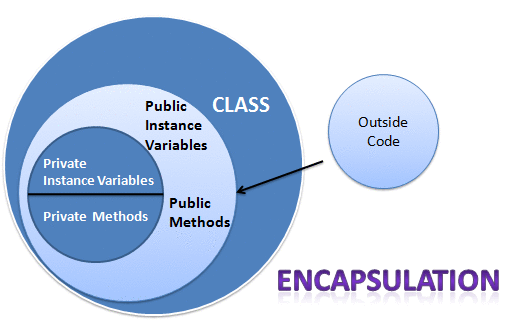
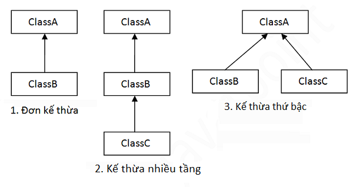

# MỌI THỨ ĐỀU LÀ HƯỚNG ĐỐI TƯỢNG
## 1.Tính đóng gói trong Java
- Tính đóng gói trong java là kỹ thuật ẩn giấu thông tin không liên quan và hiện thị ra thông liên quan. Mục đích chính của đóng gói trong java là giảm thiểu mức độ phức tạp phát triển phần mềm.
 
- Tại sao sử dụng tính đóng gói:
  - **Tăng tính bảo mật**: Tính đóng gói giúp bảo vệ dữ liệu của một class khỏi việc thay đổi bởi một class khác mà không cần biết chi tiết về cách class đó hoạt động, giúp ngăn chặn việc xảy ra lỗi và tăng tính bảo mật của chương trình.
  - **Tăng tính nhất quán**: Tính đóng gói giúp tạo ra một tường lửa giữa các thành phần của một class và các class khác, giúp giữ tính nhất quán của chương trình bằng cách ngăn chặn việc truy cập và thay đổi bởi các class không cần thiết.
  - **Giảm sự phụ thuộc**: Khi sử dụng tính đóng gói, các thành phần của một class chỉ cần biết về các thành phần có truy cập public, giúp giảm sự phụ thuộc giữa các class và giúp cho chương trình dễ dàng hơn để bảo trì và mở rộng.
  - **Tăng tính modular**: Tính đóng gói giúp tạo ra các module riêng biệt với nhau, giúp cho chương trình dễ dàng hơn để quản lý và tìm lỗi.
  - **Tăng tính dễ bảo trì và mở rộng**: Tính đóng gói giúp cho chương trình dễ dàng hơn để bảo trì và mở rộng, bởi vì nó giúp giảm sự phụ thuộc giữa các class và cho phép các thay đổi trong một class không ảnh hưởng đến các class khác.
> Ví dụ:
```Java
public class Cat{
    private String name;
    private String color;
    private int age;
    public void setName(){
        this.name = name;
    }
    public String getName(){
        return name;
    }
    public void setColor(){
        this.color= color;
    }
    public String getColor(){
        return color;
    }
    public void setAge(){
        this.age = age();
    }
    public int getAge(){
        return age;
    }
}
```
>Trong ví dụ trên các thuộc tính của class Cat được định nghĩa là private, chỉ có thể truy cập và thay đổi thông qua các phương thức setter và getter được định nghĩa là public.
## 2.Tính kế thừa trong Java
>Link bài viết tham khảo:[Tính kế thừa trong Java](https://viettuts.vn/java/tinh-ke-thua-trong-java)
### 2.1 Định nghĩa
- **Kế thừa trong java** là sự liên quan giữa hai class với nhau, trong đó có class cha (superclass) và class con (subclass). Khi kế thừa class con được hưởng tất cả các phương thức và thuộc tính của class cha. Tuy nhiên, nó chỉ được truy cập các thành viên public và protected của class cha. Nó không được phép truy cập đến thành viên private của class cha.
> Cú pháp của kế thừa trong Java:
Sử dụng từ khóa **extends** để kế thừa.
```Java
class Subclass-name extends Superclass-name{
    //code
}
```
>Ví dụ:
```Java
class Nhanvien{
    float luong = 100000;
}
class Tienthuong extends Nhanvien{
    int bonus= 1000;
}
public class Kethua{
    public static void main(String args []){
        Tienthuong nv=new Tienthuong();
        System.out.println("Luong cua nhan vien là: "+nv.luong);
        System.out.println("Tien thuong cua nhan vien là: "+nv.bonus);
    }
}
/*Kết quả:
Luong của nhan vien là: 10000
Tien thuong cua nhan vien là: 1000
*/
```
>Trong ví dụ trên class Tienthuong là con của class Nhanvien nên có thể truy cập đến trường *luong* của class Nhanvien.
### 2.2 Các kiểu kế thừa trong Java
- Có 3 kiểu kế thừa trong java đó là đơn kế thừa, kế thừa nhiều cấp, kế thừa thứ bậc.
- Khi một class được kế thừa từ nhiều class đươc gọi là đa kế thừa. Trong java, đa kế thừa chỉ được support thông qua interface(không được support thông qua class).
- 
> Ví dụ về đơn kế thừa:
```Java
class Sinhvien{
    void Ten(){
        System.out.println("Sinh vien PTIT...");
    }
}
class Khoahoc extends Sinhvien{
    void Khoahoc(){
        Sýtem.out.println("2022-2027");
    }
}
public class Kethua1{
    public static void main(String args []){
        Khoahoc a= new Khoahoc();
        a.Ten();
        a.Khoahoc();
    }
}
/*
Kết quả:
Sinh vien PTIT...
2022-2027
*/
```
>Ví dụ về kế thừa nhiều cấp:
```Java
class Sinhvien{
    void Ten(){
        System.out.println("Sinh vien PTIT...");
    }
}
class Khoahoc extends Sinhvien{
    void Khoahoc(){
        Sýtem.out.println("2022-2027");
    }
}
class Nganh extends Khoahoc{
    void Nganh(){
        System.out.println("KHMT...");
    }
}
public class Kethua2{
    public static void main(String args []){
        Nganh a= new Nganh();
        a.Ten();
        a.Khoahoc();
        a.Nganh();
    }
}
/*
Kết quả:
Sinh vien PTIT...
2022-2027
KHMT...
*/
```
>Ví dụ về kế thừa thứ bậc:
```Java
class Sinhvien{
    void Ten(){
        System.out.println("Sinh vien PTIT...");
    }
}
class Khoahoc extends Sinhvien{
    void Khoahoc(){
        Sýtem.out.println("2022-2027");
    }
}
class Nganh extends Sinhvien{
    void Nganh(){
        System.out.println("KHMT...");
    }
}
public class Kethua3{
    public static void main(String args []){
        Nganh a= new Nganh();
        a.Ten();
        //a.Khoahoc(); //compile error
        a.Nganh();
    }
}
/*
Kết quả:
Sinh vien PTIT...
KHMT...
*/
```
- Tại sao đa kế thừa không được support trong java?
  - Để giảm thiểu sự phức tạp và đơn giản hóa ngôn ngữ, đa kế thừa không được support trong java.
  - Hãy suy xét kịch bản sau: Có 3 lớp A, B, C. Trong đó lớp C kế thừa từ các lớp A và B. Nếu các lớp A và B có phương thức giống nhau và bạn gọi nó từ đối tượng của lớp con, như vậy khó có thể xác đinh được việc gọi phương thức của lớp A hay B.
  - Vì vậy lỗi khi biên dịch sẽ tốt hơn lỗi khi runtime, java sẽ print ra lỗi "compile time error" nếu bạn cố tình kế thừa 2 class.
>Ví dụ:
```Java
class A {
    void msg() {
        System.out.println("Hello");
    }
}
 
class B {
    void msg() {
        System.out.println("Welcome");
    }
}
 
public class C extends A,B { 
 public static void main(String args[]) {
        C obj = new C();
        obj.msg();
    }
}
// Compile Time Error
```
## 3.Tính đa hình trong Java
- Tính đa hình (Polymorphism) là một tính chấtcho phép một đối tượng có thể được thể hiện bởi nhiều kiểu dữ liệu khác nhau.
- Đa hình cho phép chúng ta sử dụng một tham chiếu của lớp cha để tham chiếu đến các đối tượng của lớp con kế thừa từ lớp cha đó.
### 3.1 Đa hình biên dịch(compile-time polymorphism) và đa hình chạy(run-time polumorphism).
- Đa hình biên dich:
  - Đa hình biên dịch xảy ra khi chúng ta sử dụng nạp chồng phương thức(method overloading) hoặc nạp chồng toán tử(operator overloading).
    - Nạp chồng phương thức là khả năng của một lớp có nhiều phương thức có cùng tên nhưng khác nhau về số lượng tham số hoặc kiểu dữ liệu của tham số.
        > Ví dụ:
        ```Java
         public class Example {
            public void printNumber(int num) {
                System.out.println("Số nguyên: " + num);
            }

            public void printNumber(double num) {
                System.out.println("Số thực: " + num);
            }

            public void printNumber(String str) {
                System.out.println("Chuỗi: " + str);
            }
        }
        public class Main {
            public static void main(String[] args) {
                Example example = new Example();
                example.printNumber(10); // Gọi phương thức printNumber(int)
                example.printNumber(3.14); // Gọi phương thức printNumber(double)
                example.printNumber("Hello"); // Gọi phương thức printNumber(String)
            }
        }
        /*
        Số nguyên: 10
        Số thực: 3.14
        Chuỗi: Hello
        */
        ```
    - Nạp chồng toán tử cho phép chúng ta định nghĩa lại các toán tử có sẵn trong Java(ví dụ:+,-,*,/) cho các lớp do người dùng tự định nghĩa.
        > Ví dụ:
        ```Java
        public class Example {
            public static void main(String[] args) {
                int a = 5;
                int b = 10;
                int sum = a + b;
                System.out.println("Tổng của a và b: " + sum);
                String str1 = "Hello";
                String str2 = "World";
                String str = str1 + " " + str2;
                System.out.println("Kết quả nối chuỗi: " + str);
            }
        }
        /*
        Tổng của a và b: 15
        Kết quả nối chuỗi: Hello World
        */
        ```
- Đa hình chạy:
  - Đa hình chạy xảy ra khi chúng ta sử dụng kỹ thuật ghi bè phương thức trong quá trình kế thừa.
  - Ghi đè phương thức cho phép lớp con triển khai lại(override) một phương thức đã được định nghĩa trong lớp cha.
  - Khi gọi phương thức thông qua một tham chiếu đối tượng của lớp cha,phương thức sẽ gọi dựa trên kiểu thực tế của đối tượng, không phụ thuộc vào kiểu tham chiếu
> Ví dụ:
```Java
class Animal {
    public void makeSound() {
        System.out.println("Animal is making a sound");
    }
}

class Dog extends Animal {
    public void makeSound() {
        System.out.println("Dog is barking");
    }
}

class Cat extends Animal {
    public void makeSound() {
        System.out.println("Cat is meowing");
    }
}

public class Main {
    public static void main(String[] args) {
        Animal animal1 = new Dog();
        Animal animal2 = new Cat();

        animal1.makeSound(); // Output: Dog is barking
        animal2.makeSound(); // Output: Cat is meowing
    }
}
```
